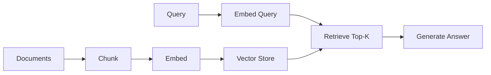

# Quickstart: RAG Deep Dive Exploratory Website

**Date**: 2026-02-17
**Feature**: 001-rag-deep-dive

## Prerequisites

- Node.js 20+ (LTS)
- npm or pnpm

## Setup

```bash
# Clone and checkout feature branch
git checkout 001-rag-deep-dive

# Install dependencies
npm install

# Start development server
npm run dev
```

The site will be available at `http://localhost:4321`.

## Project Commands

| Command | Description |
|---------|-------------|
| `npm run dev` | Start Astro dev server with hot reload |
| `npm run build` | Build static site to `dist/` |
| `npm run preview` | Preview built site locally |
| `npm run test` | Run Vitest (content validation + component tests) |
| `npm run test:e2e` | Run Playwright e2e tests |
| `npm run check` | TypeScript type checking |
| `npm run lint` | Run linter |

## Adding a New Content Page

1. Create an MDX file in the appropriate section directory:

   ```
   src/content/pages/<section>/<slug>.mdx
   ```

2. Add required frontmatter:

   ```mdx
   ---
   title: "Page Title"
   description: "Brief description for meta tags"
   section: "foundation"
   order: 4
   prerequisites: ["01-foundation/naive-rag"]
   relatedPages: ["02-retrieval-strategies/hyde"]
   prev: "01-foundation/problem-tree"
   next: "02-retrieval-strategies/symmetry-problem"
   tags: ["embeddings", "retrieval"]
   ---

   # Page Title

   Content goes here...
   ```

3. Run tests to validate the new page:

   ```bash
   npm run test
   ```

   Tests will verify:
   - Frontmatter matches the Zod schema
   - All prerequisite slugs point to existing pages
   - All relatedPages slugs point to existing pages
   - The linear path (prev/next) chain is unbroken

## Adding a Mermaid Diagram

Use a fenced code block with the `mermaid` language tag inside MDX:

```mdx
import DiagramBlock from '../../components/DiagramBlock.astro';

<DiagramBlock caption="Naive RAG Pipeline" alt="Flowchart showing the four stages of Naive RAG: chunk, embed, retrieve, generate">



</DiagramBlock>
```

## Using Components in MDX

### CrossReference

```mdx
import CrossReference from '../../components/CrossReference.astro';

Learn more about this in <CrossReference slug="02-retrieval-strategies/hyde" />.
```

### PathNotTaken

```mdx
import PathNotTaken from '../../components/PathNotTaken.astro';

<PathNotTaken
  title="Fine-tuning the embedding model"
  reason="Requires labeled training data and GPU resources.
  For most use cases, pre-trained models with HyDE/HyPE
  achieve comparable retrieval quality without the cost."
/>
```

### ComparisonTable

```mdx
import ComparisonTable from '../../components/ComparisonTable.astro';

<ComparisonTable
  columns={["Approach", "What's Indexed", "Best For"]}
  rows={[
    { "Approach": "Naive RAG", "What's Indexed": "Text chunks", "Best For": "Simple factoid Q&A" },
    { "Approach": "GraphRAG", "What's Indexed": "Entities + communities", "Best For": "Global/thematic queries" },
  ]}
/>
```

## Deployment

```bash
# Build the static site
npm run build

# Output is in dist/ — deploy to any static host
# Examples:
# - Vercel: vercel deploy
# - Netlify: netlify deploy --dir=dist
# - GitHub Pages: push dist/ to gh-pages branch
```

## Verification Checklist

After setup, verify:

- [ ] `npm run dev` starts without errors
- [ ] Landing page loads at localhost:4321
- [ ] `npm run test` passes all content validation tests
- [ ] `npm run check` reports zero TypeScript errors
- [ ] `npm run build` produces static output in `dist/`
