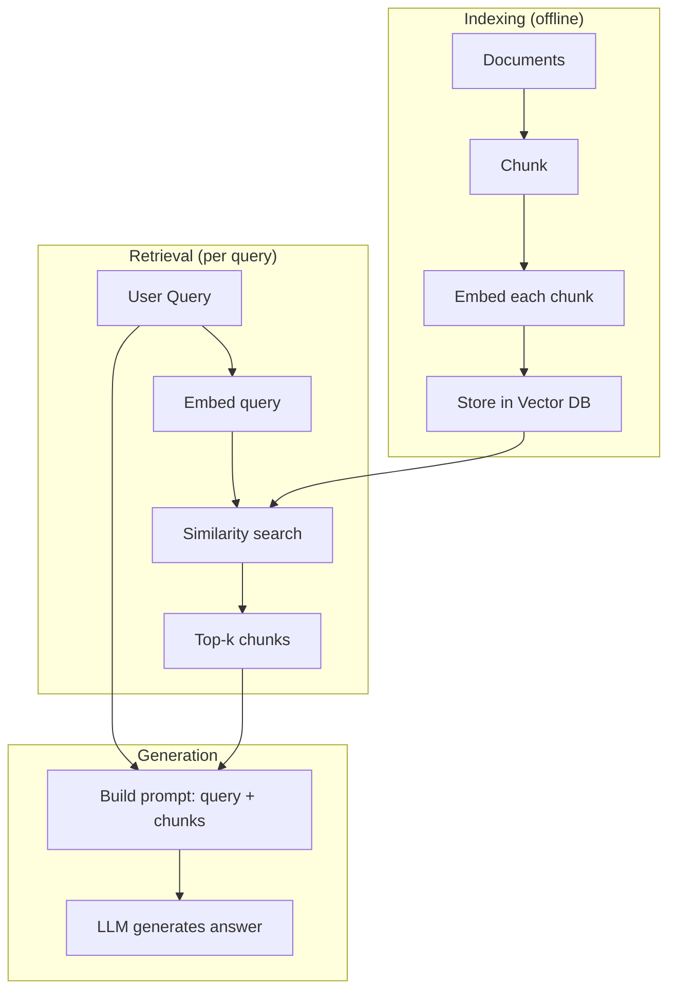

import CrossReference from '../../../components/CrossReference.astro';
import PathNotTaken from '../../../components/PathNotTaken.astro';
import DiagramBlock from '../../../components/DiagramBlock.astro';
import ComparisonTable from '../../../components/ComparisonTable.astro';
import SummaryBox from '../../../components/SummaryBox.astro';

# Naive RAG

<SummaryBox>

**Naive RAG is the baseline: chunk documents → embed chunks → store in vector DB → retrieve top-k similar chunks for each query → generate answer.**

**Why learn it:** Every advanced RAG technique exists because something in this pipeline fails. Understanding the failures drives all improvements.

**Common failures:** Questions look different from documents (symmetry problem), chunks lose context, exact keyword matches get missed, entity relationships are invisible.

**When it works:** Simple Q&A over well-structured docs where semantic similarity is enough.

</SummaryBox>

## The Simplest Thing That Could Work

Naive RAG is the baseline implementation. Every advanced RAG technique exists because something in this pipeline breaks down. Understanding it thoroughly is essential.

## The Pipeline

<DiagramBlock caption="Naive RAG: index once, retrieve per query" label="Naive RAG pipeline">

</DiagramBlock>

### Step 1: Chunking

Documents are split into smaller pieces (chunks). This is necessary because:
- Embedding models have token limits
- Smaller chunks are more precise retrieval units
- The LLM's context window is finite

**Common chunking strategies:**

| Strategy | How It Works | Trade-off |
|----------|-------------|-----------|
| Fixed-size | Split every N tokens | Simple but breaks mid-sentence |
| Sentence-based | Split on sentence boundaries | Preserves meaning but uneven sizes |
| Paragraph-based | Split on paragraph breaks | Natural boundaries but can be too large |
| Recursive | Try large splits, then smaller if too big | Adaptive but more complex |

### Step 2: Embedding

Each chunk is converted into a dense vector using an embedding model. This vector is a numerical representation of the chunk's meaning in high-dimensional space.

Key assumption: **Texts with similar meaning produce vectors that are close together.** This is where the <CrossReference slug="02-retrieval-strategies/symmetry-problem" /> first appears — queries and documents express meaning very differently.

### Step 3: Vector Storage

Vectors are stored in a vector database (Pinecone, Weaviate, Chroma, pgvector, etc.) that supports efficient nearest-neighbor search.

### Step 4: Retrieval

When a query arrives:
1. Embed the query using the **same** embedding model
2. Find the top-k nearest vectors (by cosine similarity or L2 distance)
3. Return the corresponding text chunks

### Step 5: Generation

The retrieved chunks are inserted into a prompt template alongside the original query. The LLM generates an answer grounded in those chunks.

## Where Naive RAG Breaks Down

This pipeline works surprisingly well for simple factual questions with well-written source documents. But it fails in predictable ways:

### Failure 1: The Symmetry Problem

The query "What causes inflation?" and the answer passage "Rising costs of goods and expanding money supply lead to price increases" express the same concept in very different language. The query is a **question**; the passage is a **statement**. Their embeddings may not be close enough.

This is the <CrossReference slug="02-retrieval-strategies/symmetry-problem" /> — and it drives the development of <CrossReference slug="02-retrieval-strategies/hyde" />, <CrossReference slug="02-retrieval-strategies/hype" />, and <CrossReference slug="02-retrieval-strategies/asymmetric-embeddings" />.

### Failure 2: Lost Context

Chunking destroys context. A chunk might say "This approach reduces latency by 40%" — but what approach? The referent was in a previous chunk. Naive RAG retrieves the chunk without its context.

### Failure 3: No Structural Understanding

Naive RAG treats all text as flat sequences of tokens. It cannot understand that:
- Entity A is **related to** Entity B
- Process X **causes** Process Y
- Concept C is a **subtype of** Concept D

This structural blindness motivates <CrossReference slug="03-graph-rag/graphrag" /> and the entire graph-based family.

### Failure 4: Keyword Blindness

Dense embeddings capture semantic similarity but can miss exact keyword matches. If a user searches for "RFC 7519" the embedding might not surface documents containing that exact identifier. This motivates <CrossReference slug="02-retrieval-strategies/hybrid-rag" />.

<PathNotTaken title="Increasing top-k to retrieve more chunks" reason="Retrieving more chunks increases recall but decreases precision. The LLM receives more noise, which can actually degrade answer quality. The 'lost in the middle' phenomenon shows LLMs pay less attention to information in the middle of long contexts." />

## The Problem Space

Each failure mode above represents a branch in the <CrossReference slug="01-foundation/problem-tree" />. The tree maps which techniques address which failures, giving you a roadmap for the rest of this exploration.

<ComparisonTable
  columns={["Aspect", "Naive RAG", "What's Missing"]}
  rows={[
    ["Retrieval", "Vector similarity only", "Keyword matching, structural relationships"],
    ["Understanding", "Flat text chunks", "Entities, relationships, hierarchies"],
    ["Query handling", "Embed query directly", "Query transformation, expansion"],
    ["Context", "Individual chunks", "Cross-chunk relationships, document structure"],
    ["Indexing", "Chunk → vector", "Multiple index types, graph structures"],
  ]}
/>

## What's Next

Before diving into solutions, we need to map the entire problem space systematically. The <CrossReference slug="01-foundation/problem-tree" /> organizes every failure mode and connects it to the techniques that address it.
