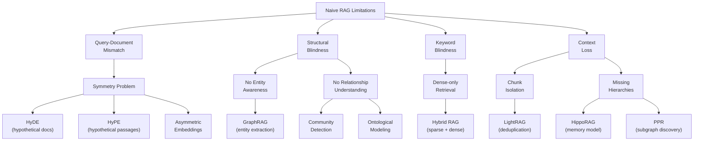
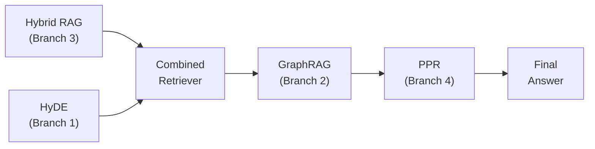

import CrossReference from '../../../components/CrossReference.astro';
import PathNotTaken from '../../../components/PathNotTaken.astro';
import DiagramBlock from '../../../components/DiagramBlock.astro';
import ComparisonTable from '../../../components/ComparisonTable.astro';

# The Problem Tree

## Why a Tree?

<CrossReference slug="01-foundation/naive-rag" /> works, but fails in specific, predictable ways. Each failure has spawned techniques to address it. This tree maps the entire landscape — it's your navigation aid for the rest of this deep dive.

## The Full Problem Tree

<DiagramBlock caption="RAG problem tree: failures branch into solution families" label="Complete problem tree diagram">

</DiagramBlock>

## Branch 1: Query-Document Mismatch

**The problem**: Users ask questions. Documents contain statements. These are linguistically different, causing embedding-based retrieval to miss relevant results.

**Root cause**: Standard embedding models are trained symmetrically — they assume both texts have the same form. But a question like "How does photosynthesis work?" and a passage explaining "Plants convert sunlight into chemical energy through chlorophyll..." use different vocabulary and sentence structures.

| Technique | Strategy | Key Idea |
|-----------|----------|----------|
| <CrossReference slug="02-retrieval-strategies/hyde" /> | Generate a hypothetical answer, search with that | Transforms question → statement before retrieval |
| <CrossReference slug="02-retrieval-strategies/hype" /> | Generate multiple hypothetical passages | Multiple hypothetical perspectives increase recall |
| <CrossReference slug="02-retrieval-strategies/asymmetric-embeddings" /> | Use different encoders for queries vs. documents | Accepts the asymmetry and models it directly |

The <CrossReference slug="02-retrieval-strategies/symmetry-problem" /> page explores this mismatch in depth.

## Branch 2: Structural Blindness

**The problem**: Naive RAG treats documents as bags of text chunks. It cannot represent that "GraphRAG" is a *technique*, that it *uses* entity extraction, which *produces* a knowledge graph that *contains* entities and relationships.

**Root cause**: Vector embeddings encode meaning but not structure. Two chunks can be semantically similar without the retriever understanding *how* they relate.

| Technique | Strategy | Key Idea |
|-----------|----------|----------|
| <CrossReference slug="03-graph-rag/graphrag" /> | Build a knowledge graph from documents | Entities and relationships become first-class objects |
| <CrossReference slug="03-graph-rag/ontology" /> | Define formal categories for graph elements | Distinguish things (endurants) from processes (perdurants) |
| <CrossReference slug="03-graph-rag/lightrag" /> | Lightweight graph with deduplication | Simpler graph construction, cross-document dedup |
| <CrossReference slug="03-graph-rag/hipporag" /> | Memory-inspired architecture | Mimics hippocampal indexing for associative retrieval |
| <CrossReference slug="03-graph-rag/ppr" /> | Personalized PageRank on the graph | Discovers relevant subgraphs from query nodes |

## Branch 3: Keyword Blindness

**The problem**: Dense embeddings capture semantic meaning but can miss exact matches. Searching for "ISO 27001" might not surface documents containing that exact term if the embedding model doesn't preserve it.

**Root cause**: Dense vectors are lossy compressions of text. Specific identifiers, codes, and proper nouns can be lost in the compression.

| Technique | Strategy | Key Idea |
|-----------|----------|----------|
| <CrossReference slug="02-retrieval-strategies/hybrid-rag" /> | Combine sparse (BM25) + dense retrieval | Best of both: exact matches + semantic similarity |

<PathNotTaken title="Using only sparse retrieval (BM25/TF-IDF)" reason="Sparse retrieval excels at exact matching but fails at semantic understanding. 'automobile' and 'car' are treated as completely different terms. Pure sparse retrieval was the pre-neural baseline, not the solution." />

## Branch 4: Context Loss

**The problem**: Chunking documents destroys context. Pronouns lose their referents, relative terms lose their anchors, and hierarchical relationships are flattened.

**Root cause**: Fixed-size chunking is a local operation — it cannot preserve global document structure.

| Technique | Strategy | Key Idea |
|-----------|----------|----------|
| <CrossReference slug="03-graph-rag/lightrag" /> | Cross-document entity deduplication | Recognizes the same entity across chunks |
| <CrossReference slug="03-graph-rag/hipporag" /> | Hippocampal memory model | Pattern separation + completion for context recovery |
| <CrossReference slug="03-graph-rag/ppr" /> | Graph-based context expansion | Walks the graph to find contextually connected nodes |

## How the Branches Interact

These branches are not independent. Real-world RAG systems often combine techniques from multiple branches:

<DiagramBlock caption="Techniques often combine across branches" label="Technique combination diagram">

</DiagramBlock>

For example:
- **HyDE + Hybrid RAG**: Transform the query (Branch 1) then use both sparse and dense retrieval (Branch 3)
- **GraphRAG + PPR**: Build a knowledge graph (Branch 2) and use PageRank to find relevant subgraphs (Branch 4)
- **LightRAG**: Addresses both structural blindness (Branch 2) and context loss (Branch 4) in a lightweight package

## Reading Paths

From here, you can follow any branch that interests you. The recommended linear path goes through them in order of increasing complexity:

1. **Start with the Symmetry Problem** (Branch 1) — <CrossReference slug="02-retrieval-strategies/symmetry-problem" />
2. **Then Graph-Based RAG** (Branch 2) — <CrossReference slug="03-graph-rag/graphrag" />
3. **Finish with Synthesis** — <CrossReference slug="04-synthesis/progressive-map" />

Or jump directly to any technique using the sidebar navigation.

## What's Next

Let's begin with Branch 1 and the fundamental <CrossReference slug="02-retrieval-strategies/symmetry-problem" /> that affects all embedding-based retrieval systems.
