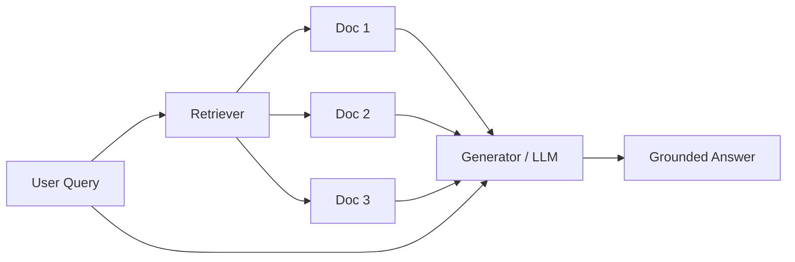

import CrossReference from '../../../components/CrossReference.astro';
import PathNotTaken from '../../../components/PathNotTaken.astro';
import DiagramBlock from '../../../components/DiagramBlock.astro';
import SummaryBox from '../../../components/SummaryBox.astro';

# Why RAG?

<SummaryBox>

**RAG (Retrieval-Augmented Generation) solves the core problem that LLMs can't access knowledge beyond their training data.**

**The pattern:** Retrieve relevant documents → Augment the prompt with them → Generate an answer grounded in those documents.

**Why it matters:** Knowledge stays fresh (update the index, not the model), answers are verifiable (linked to sources), and hallucinations become detectable (if retrieval fails, we know why).

**When to use:** Anytime you need LLMs to answer questions using specific, up-to-date, verifiable information.

</SummaryBox>

## The Core Problem: LLMs and Knowledge

Large Language Models are remarkable pattern-matching engines. They learn statistical relationships between tokens during training and can generate fluent, coherent text. But they have a fundamental limitation: **everything they "know" was frozen at training time**.

This creates three concrete problems:

1. **Staleness** — The model cannot know about events, papers, or data that appeared after its training cutoff.
2. **Hallucination** — When the model lacks knowledge, it generates plausible-sounding but incorrect answers rather than admitting ignorance.
3. **Opacity** — There is no way to trace a generated claim back to a specific source document.

## First Principles: What Do We Actually Need?

Before jumping to solutions, let's state the requirement clearly:

> We need a system that can answer questions using **specific, verifiable, up-to-date knowledge** while leveraging the language understanding capabilities of LLMs.

Breaking this down:
- **Specific**: Answers grounded in actual documents, not statistical patterns
- **Verifiable**: Every claim traceable to a source
- **Up-to-date**: Reflects current information, not just training data
- **Language understanding**: Natural language questions, natural language answers

## The Two Obvious Approaches (And Why They Fall Short)

<PathNotTaken title="Fine-tuning the model on new data" reason="Fine-tuning changes the model's weights to encode new knowledge, but it's expensive, slow, cannot be easily updated, and still cannot provide source citations. It changes what the model 'remembers' but doesn't solve the verification problem." />

<PathNotTaken title="Stuffing everything into the prompt" reason="You could paste relevant documents into the context window, but context windows are finite (even large ones have limits), it's expensive per query, and you still need a way to select which documents to include — which is exactly the retrieval problem." />

## The RAG Insight

The name **Retrieval-Augmented Generation** describes exactly what happens, in order. Each word carries architectural weight:

### **R** — Retrieval

The system does not guess. Given a query, it searches a knowledge base and pulls back specific documents (or chunks of documents) that are likely relevant. This is the same core problem that search engines solve, but applied at a different scale: instead of ranking web pages for a human to browse, the retriever selects context for a language model to consume.

Retrieval typically works through **vector similarity**. Documents are converted into high-dimensional vectors (embeddings) that capture their meaning. At query time, the query is embedded into the same space, and the nearest document vectors are returned. This means "relevant" is defined mathematically — cosine distance or dot product between vectors — not by keyword overlap alone.

The retriever is the gatekeeper: **if the right documents are not retrieved, no amount of generation quality can compensate**. This is why most RAG research focuses on improving retrieval.

### **A** — Augmented

This is the architectural insight. The LLM is not retrained or fine-tuned with new knowledge. Instead, its input is **augmented** — the retrieved documents are injected into the prompt alongside the user's query. The model's parameters stay frozen; only its context changes.

This means:
- **Updating knowledge does not require touching the model.** Re-index new documents and the system knows new things.
- **The same model serves different knowledge bases.** Swap the index, and an LLM that answered medical questions now answers legal ones.
- **Augmentation is transparent.** You can inspect exactly what context the model received, making debugging and auditing possible.

### **G** — Generation

The LLM reads the retrieved documents and the original query, then synthesizes a natural-language answer. It is not copying and pasting — it is reasoning over the provided context: resolving conflicts between sources, combining information from multiple passages, and formatting the answer for the user's question.

Generation is where the LLM's strengths shine: language understanding, summarization, inference, and fluency. But critically, the model is now **constrained** by the retrieved context. A well-designed RAG system instructs the model to answer only from the provided documents, reducing (though not eliminating) hallucination.

### How They Compose

<DiagramBlock caption="The RAG pattern: retrieve first, then generate" label="RAG basic flow diagram">

</DiagramBlock>

The key insight is **separation of concerns**:
- The retriever handles **finding** relevant information
- The generator handles **synthesizing** a coherent answer
- The knowledge base can be **updated independently** of the model

## Why This Matters

RAG transforms LLMs from closed systems (limited to training data) into open systems (connected to living knowledge bases). This is not merely an optimization — it's a fundamental architectural shift.

| Without RAG | With RAG |
|------------|----------|
| Knowledge frozen at training time | Knowledge updated by updating the index |
| No source attribution | Every answer linked to source documents |
| Hallucination indistinguishable from knowledge | Retrieval failures are detectable |
| Retraining required for new knowledge | Re-index documents instead |

## Assumptions We're Making

Before proceeding, let's be explicit about our assumptions:

1. **The knowledge exists in documents** — RAG assumes you have a corpus of text that contains the answers.
2. **Relevance is computable** — We assume that mathematical similarity (e.g., vector distance) correlates with semantic relevance.
3. **The LLM can synthesize** — Given the right context, the LLM can produce an accurate answer.

Each of these assumptions will break down in interesting ways as we explore deeper. The <CrossReference slug="01-foundation/problem-tree" /> maps exactly where these assumptions fail and what strategies address each failure.

## What's Next

Now that we understand *why* RAG exists, let's look at the simplest possible implementation: <CrossReference slug="01-foundation/naive-rag" />. Understanding the naive approach first gives us a baseline against which all improvements can be measured.
