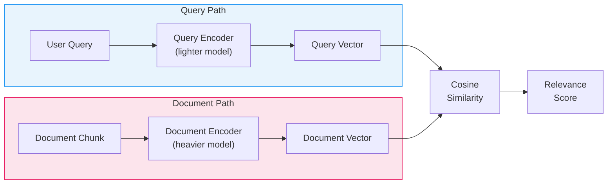

## Asymmetric Embeddings

HyDE and HyPE solve the symmetry problem by transforming one side of the comparison to match the other. Asymmetric embeddings take a fundamentally different approach: instead of changing the inputs, they change the embedding model itself. The model is designed (or fine-tuned) to *expect* that queries and documents are structurally different and to map them into a shared space despite that difference.

### The Three Approaches

There are three main ways to build asymmetric embedding capability, each representing a different level of architectural commitment.

#### 1. Dual Encoders

The most architecturally explicit approach uses two entirely separate encoder networks -- one for queries and one for documents. Both encoders produce vectors in the same dimensional space, but their internal weights are trained independently to handle their respective input types.

The query encoder learns to map short, interrogative text into the shared space. The document encoder learns to map long, expository text into the same space. During training, they are jointly optimized so that matching query-document pairs end up close together.

A key advantage of dual encoders is that you can use different model sizes. The document encoder runs once per chunk during indexing, so it can be large and slow. The query encoder runs on every request, so it should be fast. This asymmetry in compute budget maps naturally to the asymmetry in usage patterns.

#### 2. Instruction-Tuned Prefixes

A simpler approach, popularized by models like E5 and Nomic Embed, uses a single model but with different instruction prefixes for queries and documents:

- Query input: `"search_query: What causes climate change?"`
- Document input: `"search_document: Greenhouse gases such as carbon dioxide trap heat..."`

The prefix acts as a mode switch. The model has been trained to interpret the same underlying text differently depending on the prefix, adjusting its internal representations to account for the structural differences between queries and documents. This approach requires no architectural changes -- just a convention enforced during training and inference.

#### 3. Matryoshka and Adaptive Approaches

Newer embedding models support variable-dimension output, where you can truncate the embedding vector to different sizes depending on your latency and precision requirements. When combined with asymmetric training, this allows a further optimization: use full-dimension vectors for documents (computed once) and truncated vectors for queries (computed per request), trading a small amount of precision for faster query-time computation.

### Why Asymmetric Embeddings Work

The training process for asymmetric models uses contrastive learning on large datasets of (query, relevant document) pairs. The model learns the statistical patterns that distinguish queries from documents and builds internal representations that compensate for these differences.

For example, the model learns that:

- Questions often *imply* information that documents *state explicitly*
- Queries use common vocabulary while documents use domain-specific terms
- Short text needs to be projected into a richer representation than its surface form suggests

This learned compensation is what allows a query vector and a document vector to end up close together in the shared embedding space even though their input text looks very different.

### Choosing Between Approaches

| Approach | Setup Cost | Query Latency | Accuracy | Flexibility |
|----------|-----------|---------------|----------|-------------|
| Dual Encoders | High (train two models) | Low (small query model) | Highest | Low (locked to specific models) |
| Instruction Prefixes | None (use off-the-shelf) | Medium (same model) | High | High (swap models easily) |
| Adaptive Dimensions | Low (use compatible model) | Tunable | Good | Medium |

For most teams, instruction-tuned models like E5-large, Nomic Embed, or Cohere's embed models offer the best balance: strong asymmetric performance with zero training investment. Dual encoders are worth the effort only when you have a specialized domain with enough labeled data to justify custom training.

### Asymmetric Embeddings vs. HyDE/HyPE

Asymmetric embeddings solve the symmetry problem at the model level rather than the pipeline level. This means:

- **No added LLM calls** -- no extra latency or cost at query time or index time
- **No hypothetical text generation** -- no risk of LLM hallucination affecting retrieval
- **Model dependency** -- you are constrained to models that support asymmetric encoding, which limits your choices

In practice, asymmetric embeddings and HyDE/HyPE are not mutually exclusive. You can use an asymmetric embedding model *and* apply HyDE on top of it for especially difficult queries. The approaches are complementary.

> **Path Not Taken:** The simplest possible approach is to ignore the symmetry problem entirely and use a single symmetric encoder (like the original BERT sentence-transformers) for everything. This works adequately when queries happen to resemble documents -- for example, when users search by pasting in a sentence they remember from a document. But for natural-language questions, which represent the vast majority of real-world RAG usage, symmetric encoders systematically underperform. The structural mismatch between queries and documents is not a minor inefficiency -- it is a primary failure mode in production RAG systems.
