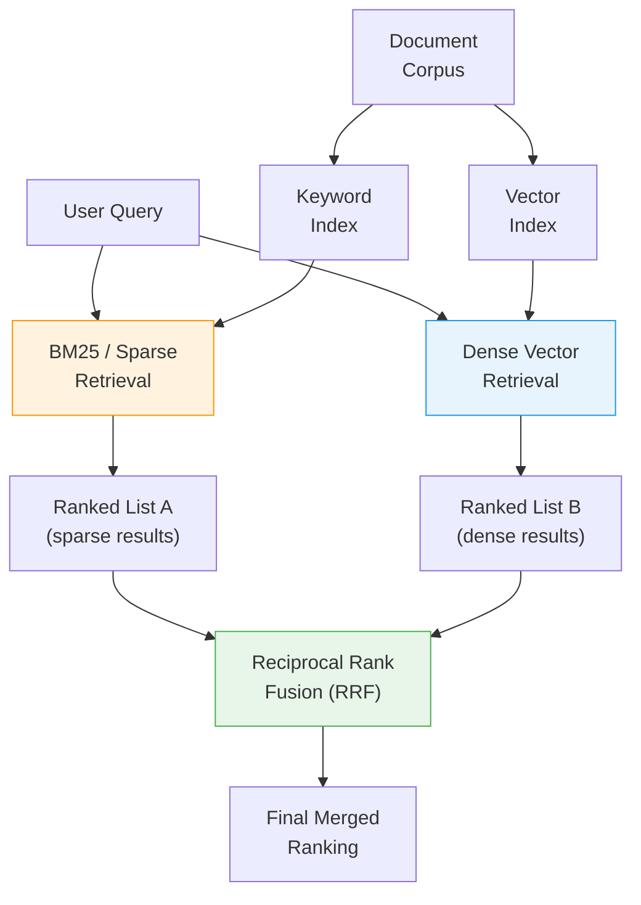

## Hybrid RAG

The retrieval strategies we have explored so far all operate in dense vector space. They improve *how* embeddings are compared, but they share a common blind spot: dense retrieval can miss documents that contain exact keywords the user specified. Hybrid RAG addresses this by running two retrieval systems in parallel -- sparse keyword search and dense vector search -- and fusing their results.

### Two Retrieval Paradigms

**Sparse retrieval (BM25)** treats documents as bags of words. It scores documents based on term frequency, inverse document frequency, and document length. It excels at exact lexical matching -- if the user types "BERT", BM25 will find every document containing the token "BERT" regardless of context.

**Dense retrieval (vector search)** maps text into continuous embedding space. It excels at semantic matching -- understanding that "transformer architecture" and "attention-based neural network" refer to related concepts even though they share no words.

Neither approach dominates the other. They have complementary strengths and weaknesses:

| Dimension | BM25 (Sparse) | Vector Search (Dense) |
|-----------|---------------|----------------------|
| **Exact terms** | Excellent -- finds exact token matches | Poor -- may embed rare terms incorrectly |
| **Synonyms / paraphrases** | Poor -- no semantic understanding | Excellent -- captures meaning |
| **Rare / technical terms** | Excellent -- treats them as distinctive tokens | Poor -- undertrained on rare vocabulary |
| **Typos** | Poor -- "BRET" will not match "BERT" | Moderate -- embedding may absorb small variations |
| **Out-of-domain queries** | Reasonable -- keywords still work | Poor -- embeddings may not generalize |
| **Setup complexity** | Low -- well-understood, mature tooling | Medium -- requires embedding model selection |

### The Hybrid Architecture

Hybrid RAG runs both retrieval systems on every query and merges their results using a fusion algorithm.



### Reciprocal Rank Fusion (RRF)

The key challenge in hybrid retrieval is combining two ranked lists that use incompatible scoring systems. BM25 scores are unbounded term-frequency values; vector similarity scores are cosine values between -1 and 1. You cannot simply average them.

Reciprocal Rank Fusion sidesteps this problem by ignoring the raw scores entirely and using only the rank positions. For each document appearing in either list, RRF computes:

```
RRF_score(d) = sum over all lists L: 1 / (k + rank_L(d))
```

where `k` is a constant (typically 60) that dampens the influence of high-ranking positions. Documents that appear near the top of *both* lists receive the highest fused scores. Documents that rank well in only one list still appear but with lower scores.

### Worked Example

Consider a knowledge base about machine learning and the following two queries:

**Query 1: "BERT fine-tuning learning rate"**

This query contains a specific technical term (BERT) and precise keywords. BM25 immediately finds documents containing "BERT" and "fine-tuning" and "learning rate." Dense retrieval, however, might embed "BERT" closer to general NLP concepts and return documents about transformer training in general, missing the specific BERT fine-tuning guides. Here, BM25 carries the retrieval.

**Query 2: "How to make a pre-trained language model work on my specific task"**

This query describes the concept of fine-tuning without using the word "fine-tuning" at all. BM25 matches on common words like "model" and "task," returning noisy results. Dense retrieval understands the semantic intent and surfaces documents about transfer learning and fine-tuning. Here, vector search carries the retrieval.

In a hybrid system, both queries return strong results because the weaker retriever's misses are compensated by the stronger retriever's hits. The fusion step preserves the best of both.

### Implementation Considerations

- **Dual indexing:** You need to maintain both a keyword index (Elasticsearch, OpenSearch, or a BM25 implementation like rank-bm25) and a vector index (Pinecone, Weaviate, pgvector, etc.). Some databases like Weaviate and Elasticsearch now support both in a single system.
- **Latency:** Both retrievals run in parallel, so latency is determined by the slower of the two (usually comparable). The fusion step is negligible.
- **Weighting:** While RRF treats both lists equally by default, you can adjust the relative influence by multiplying one list's RRF contributions by a weight factor. Tuning this weight per-domain can yield meaningful gains.
- **Top-k selection:** Each retriever returns its own top-k candidates. These do not need to be the same k -- you might retrieve 20 candidates from BM25 and 20 from vector search, then fuse and take the top 10.

### When to Use Hybrid RAG

Hybrid RAG is a strong default choice for production systems. The incremental cost of maintaining a keyword index alongside a vector index is low, and the retrieval robustness gains are substantial. It is especially valuable when:

- Your users mix natural language questions with keyword-heavy searches
- Your corpus contains technical terms, acronyms, or proper nouns
- You cannot predict whether a given query will be better served by lexical or semantic matching

> **Path Not Taken:** Instead of running two parallel retrieval systems, an alternative is to run a single retrieval method (either sparse or dense) and then apply a cross-encoder re-ranker on the results. Re-ranking can dramatically improve the *ordering* of retrieved documents, but it cannot recover documents that were never retrieved in the first place. If BM25 missed a semantically relevant document, no amount of re-ranking will bring it back. Hybrid retrieval addresses *recall* -- the breadth of relevant documents surfaced -- while re-ranking addresses *precision* -- the ordering of those documents. In practice, the most robust systems use both: hybrid retrieval for recall, followed by cross-encoder re-ranking for precision.
