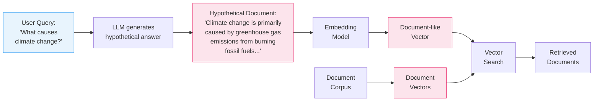

## HyDE: Hypothetical Document Embeddings

HyDE is a query-time transformation that resolves the symmetry problem by converting a user's question into a hypothetical answer *before* embedding it. Instead of comparing a question embedding against document embeddings (asymmetric), you compare an answer embedding against document embeddings (symmetric). The insight is elegant: even a fabricated answer is structurally closer to real documents than a question ever could be.

### How HyDE Works

The process adds one step to the standard RAG pipeline. When a user submits a query, an LLM first generates a hypothetical answer -- a plausible-sounding passage that *might* answer the question. This generated text does not need to be factually correct. It just needs to sound like the kind of document that would contain the answer.

That hypothetical document is then embedded using the same model used to embed your corpus. The resulting vector now lives in the *document region* of embedding space rather than the query region. Nearest-neighbor search proceeds as normal, but now it is document-to-document comparison -- exactly the kind of symmetric matching where cosine similarity excels.

Notice how the hypothetical document (pink) now lives in the same region as the corpus documents (also pink). The query has been "translated" from query-space into document-space.

### A Concrete Example

**Query:** "What causes climate change?"

**Hypothetical document generated by the LLM:** "Climate change is primarily driven by the accumulation of greenhouse gases in Earth's atmosphere. The combustion of fossil fuels releases carbon dioxide, while agricultural practices and deforestation contribute methane and nitrous oxide. These gases trap outgoing infrared radiation, creating a warming effect that disrupts global climate patterns."

This passage is not sourced from any real document. It may contain inaccuracies. But it *reads like* a document passage, and that structural similarity is what matters for embedding alignment.

### Why Factual Correctness Doesn't Matter

This is the most counterintuitive aspect of HyDE. The hypothetical answer can be wrong on details, and the system still works. Why? Because the embedding model captures *topical and structural* patterns, not factual truth. A fabricated paragraph about greenhouse gases will embed near real paragraphs about greenhouse gases, regardless of whether the specific claims are accurate. The real documents retrieved in the next step provide the factual grounding.

### The Trade-Off: Query-Time Latency

HyDE introduces an LLM call into the retrieval path. Every query now requires:

1. An LLM generation step (typically 500ms--2s depending on the model)
2. An embedding step for the hypothetical document
3. The vector search itself

For applications where sub-second retrieval matters -- autocomplete, real-time chat, high-throughput APIs -- this added latency can be a dealbreaker. The LLM call cannot be precomputed because it depends on the user's query, which is unknown until request time.

### When to Use HyDE

HyDE works best when:

- Your corpus is static or changes infrequently (no extra indexing cost)
- Query latency budgets are generous (1--3 seconds is acceptable)
- You already have an LLM in the pipeline (the generation model can double as the HyDE generator)
- Your embedding model is a general-purpose symmetric encoder not trained for query-document matching

> **Path Not Taken:** An alternative approach to bridging the embedding gap is to fine-tune the embedding model itself on query-document pairs from your domain. This would teach the model to place related queries and documents close together despite their structural differences. However, fine-tuning requires a large dataset of labeled (query, relevant document) pairs, which is expensive to create and curate. It also couples your retrieval quality to a specific model version -- every time you want to upgrade your embedding model, you need to re-fine-tune and re-index. HyDE achieves a similar effect with zero training data and works with any off-the-shelf embedding model.
