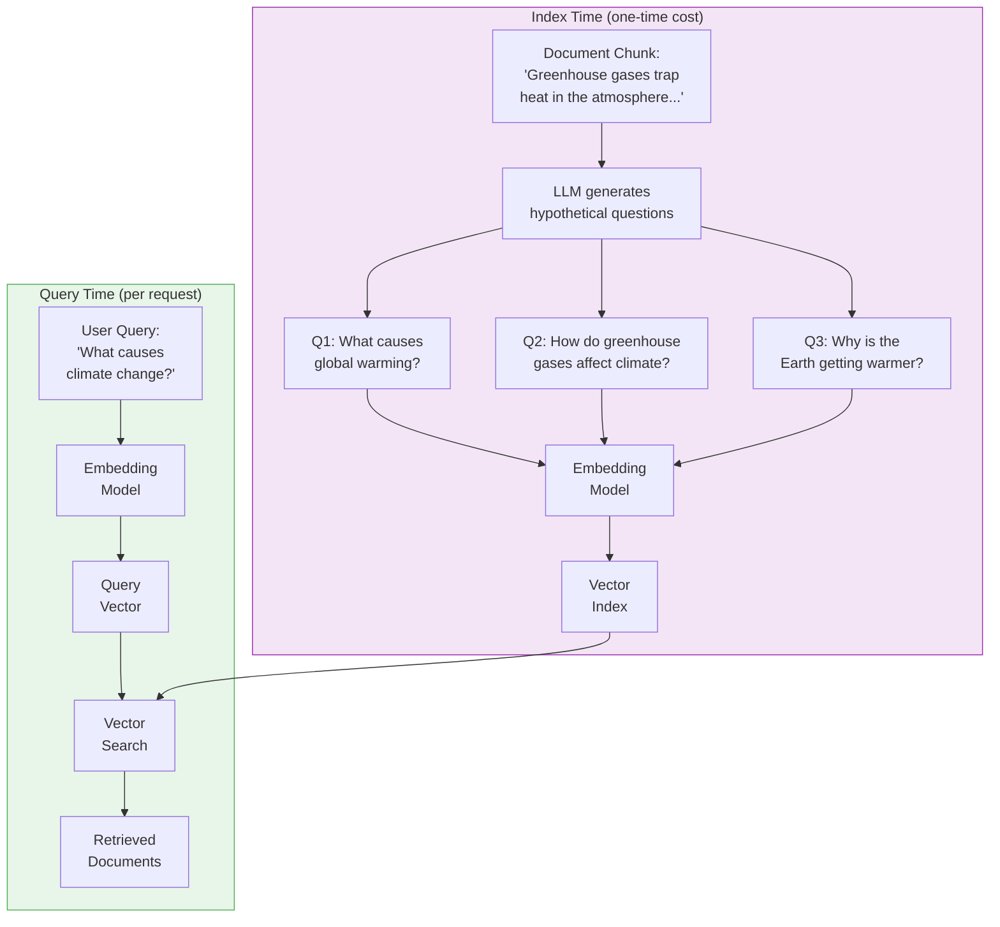

import SummaryBox from '../../../components/SummaryBox.astro';

<SummaryBox>

**HyPE is the mirror of HyDE: generate hypothetical questions for each document at index time → embed the questions → at query time, compare question-to-question (symmetric).**

**Key difference from HyDE:** Moves LLM cost from query time (expensive per-query) to index time (one-time cost). Zero query latency overhead.

**How it works:** For each chunk, LLM generates 3-5 questions it could answer → questions are embedded and stored alongside the chunk.

**When to use:** When query latency is critical and indexing cost is acceptable. Ideal for static corpora that don't update frequently.

**Trade-off:** Higher indexing cost and storage (multiple embeddings per chunk), but faster queries than HyDE.

</SummaryBox>

## HyPE: Hypothetical Prompt Embeddings

HyPE is the mirror image of HyDE. Where HyDE transforms queries into hypothetical answers at query time, HyPE transforms documents into hypothetical questions at index time. The result is the same -- symmetric comparison -- but the work shifts from the query path to the indexing path, which has profound implications for latency and cost.

### The Core Idea

For each document chunk in your corpus, an LLM generates a set of hypothetical questions that the chunk could answer. These generated questions are embedded and stored in your vector index alongside (or instead of) the original document embeddings. At query time, the user's question is embedded and compared against these pre-generated questions. Now you are comparing question-to-question -- a symmetric match.

### HyDE vs. HyPE: A Side-by-Side Comparison

| Dimension | HyDE | HyPE |
|-----------|------|------|
| **Transformation** | Query to hypothetical answer | Document to hypothetical questions |
| **When it runs** | Query time (every request) | Index time (once per chunk) |
| **Comparison type** | Answer-to-answer | Question-to-question |
| **Query latency** | High (LLM call per query) | Low (just embedding + search) |
| **Index cost** | None (standard indexing) | High (LLM call per chunk) |
| **Index size** | Standard | Larger (multiple questions per chunk) |
| **Corpus updates** | No extra cost | Must re-generate questions for new chunks |

The choice between HyDE and HyPE comes down to where you can afford to spend compute. If your corpus changes rarely and you need fast query responses, HyPE is the stronger choice. If your corpus changes frequently and users can tolerate slightly slower queries, HyDE avoids the re-indexing cost.

### Performance Gains

Research and production deployments have shown that HyPE can improve retrieval precision by up to 42% compared to naive dense retrieval on certain benchmarks. The gains are especially pronounced for:

- **Short, ambiguous queries** where the user's phrasing diverges from document language
- **Domain-specific corpora** where technical documents use jargon that users do not
- **Multi-topic chunks** where a single passage could answer several distinct questions -- HyPE generates a question for each angle, improving recall

### Practical Considerations

Generating hypothetical questions at scale requires care:

- **Quality control:** Not all LLM-generated questions are useful. Filter out overly generic questions ("What is this about?") and keep specific, answerable ones.
- **Number of questions per chunk:** Typically 3--5 questions per chunk strikes a good balance. More questions improve recall but increase index size and cost.
- **Index storage:** If each chunk generates 5 questions, your vector index is 5x larger. This is usually manageable -- vectors are small -- but it affects search latency at very large scales.
- **Chunk-to-question mapping:** Store a mapping from each generated question back to its source chunk so you can retrieve the original document text for the final response.

### When to Use HyPE

HyPE is the right choice when:

- Query latency is critical (sub-200ms retrieval)
- Your corpus is relatively stable (re-indexing is infrequent)
- You have the compute budget for a one-time LLM processing pass over your corpus
- Users ask questions in natural language (not keyword searches)

> **Path Not Taken:** A natural question is whether combining HyDE and HyPE yields even better results -- transforming both the query and the documents. In theory, this double transformation should further tighten the embedding alignment. In practice, the gains show diminishing returns. The first transformation (either HyDE or HyPE) captures most of the benefit by bridging the structural gap. Adding the second transformation increases system complexity -- you now have LLM calls on both the index and query paths -- while delivering marginal improvement. The added failure modes (two LLM calls that can hallucinate or timeout) rarely justify the small precision gain.
