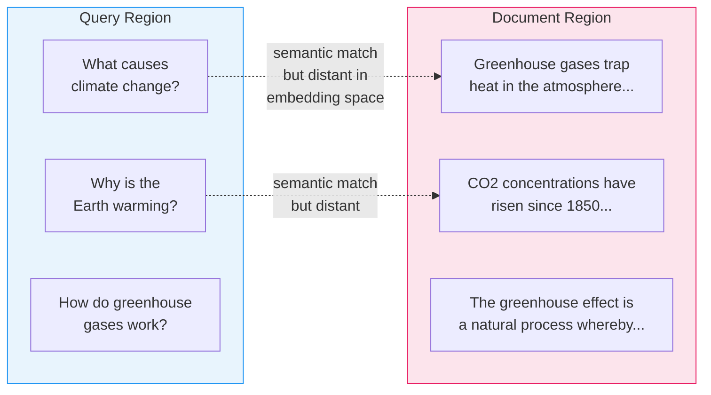

## The Symmetry Problem

At the heart of naive RAG lies a deceptively simple assumption: if a query and a document are about the same topic, their embeddings should be close together in vector space. In practice, this assumption breaks down in a fundamental way. Queries and documents are structurally different kinds of text, and that structural difference pushes them into different regions of embedding space -- even when they share the same semantic meaning.

### Queries vs. Documents: A Structural Mismatch

Consider the difference between how people ask questions and how knowledge is written down:

- **Queries** are short, interrogative, and incomplete. They express an information *need*: "What causes climate change?"
- **Documents** are long, expository, and self-contained. They express information *fulfillment*: "Greenhouse gases such as carbon dioxide and methane trap heat in the Earth's atmosphere. Human activities, particularly the burning of fossil fuels and deforestation, have dramatically increased the concentration of these gases since the Industrial Revolution, leading to a measurable rise in global average temperatures."

These two pieces of text are clearly about the same topic. A human would immediately recognize the document as a good answer to the query. But an embedding model trained on general-purpose similarity sees two very different surface forms -- one is six words with a question mark, the other is two dense sentences of scientific exposition.

### Two Clusters in Vector Space

When you embed a large corpus of queries and a large corpus of document passages, they do not intermingle freely. Instead, they tend to form distinct clusters.

The dashed lines represent the semantic relationships that *should* drive retrieval. But cosine similarity operates on raw vector distance, and the gap between these two regions means that the nearest neighbor to a query is often another query-like text, not the document that actually answers it.

### Why Cosine Similarity Fails

Cosine similarity measures the angle between two vectors. It works beautifully when comparing like with like -- document to document, or question to question. The problem is that naive RAG compares unlike with unlike: a question vector against an answer vector.

Think of it this way: the sentence "What causes climate change?" is structurally more similar to "What causes inflation?" than it is to a paragraph explaining the greenhouse effect. An embedding model captures both structural patterns and semantic content, and when the structural signal dominates, the wrong documents get retrieved.

This is the symmetry problem: **effective retrieval requires symmetric comparison** (question-to-question or answer-to-answer), but naive RAG performs an asymmetric comparison (question-to-answer).

### The Three Paths Forward

The rest of this section explores three distinct strategies for resolving the symmetry problem:

1. **HyDE** -- transform the query into a hypothetical answer at query time, so you compare answer-to-answer.
2. **HyPE** -- transform documents into hypothetical questions at index time, so you compare question-to-question.
3. **Asymmetric Embeddings** -- use models specifically trained to map queries and documents into a shared space despite their structural differences.

Each approach has different trade-offs in latency, cost, and accuracy. Understanding *why* the symmetry problem exists is the first step toward choosing the right solution.

> **Path Not Taken:** One could attempt to solve this by simply making queries longer -- appending context or rephrasing them as statements before embedding. While query expansion helps marginally, it does not fundamentally resolve the structural mismatch. A padded query is still not an expository passage, and the embedding gap persists.
