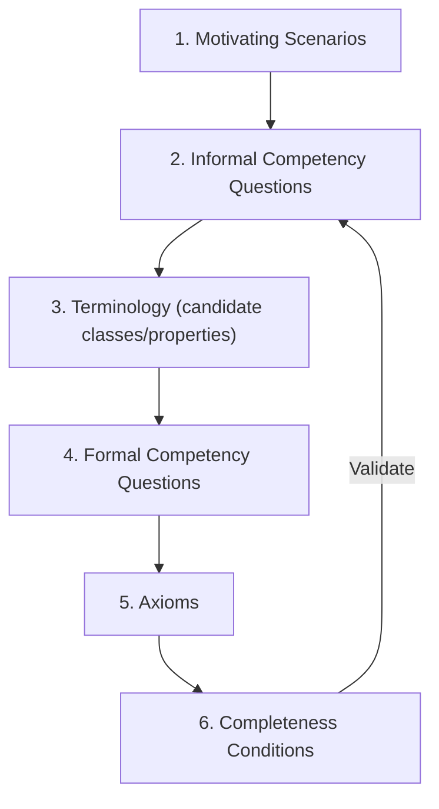
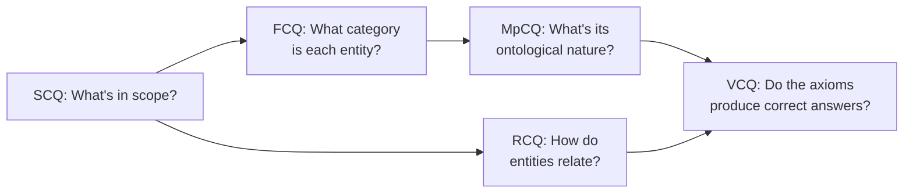

import CrossReference from '../../../components/CrossReference.astro';
import PathNotTaken from '../../../components/PathNotTaken.astro';
import DiagramBlock from '../../../components/DiagramBlock.astro';
import ComparisonTable from '../../../components/ComparisonTable.astro';

# Competency Questions for RAG

## Why Not Just Draw Boxes and Arrows?

The <CrossReference slug="03-graph-rag/ontology" /> page introduced endurants and perdurants — but how do ontologists actually *decide* what goes into an ontology? They don't just brainstorm entities. They use **Competency Questions** (CQs): precise questions that define what the ontology must be able to answer.

This is the Gruninger & Fox methodology, and it turns ontology design from art into engineering.

## The Gruninger & Fox Methodology

In 1995, Michael Gruninger and Mark Fox proposed a systematic approach: start with scenarios, derive questions, then build axioms that can answer those questions.

<DiagramBlock caption="The CQ methodology: from scenarios to validated ontology" label="CQ methodology flowchart">

</DiagramBlock>

The key insight: **CQs are the functional requirements of an ontology.** Just as software requirements define what a system must do, CQs define what an ontology must represent and answer.

## The Five Types of Competency Questions

Recent research (Keet & Khan, 2024) identifies five distinct CQ types, each serving a different purpose in ontology design.

<ComparisonTable
  columns={["CQ Type", "Purpose", "When Used", "Who Answers"]}
  filterColumn="CQ Type"
  rows={[
    ["SCQ (Scoping)", "Defines ontology boundaries", "Before design", "Domain expert"],
    ["VCQ (Validation)", "Tests correctness of axioms", "During/after design", "SPARQL query"],
    ["FCQ (Foundational)", "Aligns to upper ontology", "During design", "Ontology modeller"],
    ["RCQ (Relationship)", "Specifies relation properties", "During design", "Ontology modeller"],
    ["MpCQ (Meta-property)", "Classifies entity nature", "During design", "Ontology modeller"],
  ]}
/>

---

## SCQ: Scoping Competency Questions

**What they do**: Define what the ontology covers and what it excludes. SCQs establish boundaries *before* any formal modeling begins.

**Key property**: SCQs need not be answerable by the ontology itself — they're design inputs, not outputs.

### RAG Examples

> **SCQ-1**: "What types of documents can serve as a knowledge corpus in a RAG system?"

This scopes the ontology to include Document, DocumentChunk, and related entities. It implicitly excludes the internal weights of the language model (out of scope).

> **SCQ-2**: "What components make up the retrieval pipeline of a RAG system?"

This scopes the ontology to include Retriever, VectorIndex, EmbeddingModel, and the processes connecting them.

> **SCQ-3**: "What metrics characterize the quality of a RAG retrieval result?"

This brings RelevanceScore, Precision, and Recall into scope as quality entities.

<PathNotTaken title="Skipping scoping and jumping to formal modeling" reason="Without SCQs, you risk building an ontology that's either too broad (modeling irrelevant concepts) or too narrow (missing critical entities). SCQs are cheap to write and save expensive rework later." />

---

## VCQ: Validation Competency Questions

**What they do**: Test whether the ontology's axioms correctly represent domain knowledge. VCQs must be formalizable as queries (e.g., SPARQL) and answerable by the ontology.

**Key property**: The ontology must *entail* the answer — if it can't, the axioms are incomplete.

### RAG Examples

> **VCQ-1**: "Is every retrieved chunk traceable to exactly one source document?"

Expected answer: Yes. This validates the `derivedFrom` relationship between DocumentChunk and Document is mandatory and functional.

> **VCQ-2**: "Can a single query produce multiple retrieval results with different relevance scores?"

Expected answer: Yes. This validates that the `retrievedFor` relationship is one-to-many with an associated RelevanceScore.

> **VCQ-3**: "Does every RAG response have at least one supporting retrieved chunk?"

Expected answer: Yes (for standard RAG — a zero-shot fallback would be a different pattern). This validates the provenance chain.

---

## FCQ: Foundational Competency Questions

**What they do**: Determine how domain entities align to categories from a foundational ontology (like DOLCE, BFO, or SUMO). FCQs bridge your domain-specific entities to universal philosophical categories.

**Key property**: Uses vocabulary from the foundational ontology — terms like *endurant*, *perdurant*, *quality*, *role*.

### RAG Examples

> **FCQ-1**: "Is 'DocumentChunk' a physical endurant or a non-physical endurant in DOLCE?"

Answer: **Non-physical endurant** — it's an information object, not a physical substance.

> **FCQ-2**: "Is 'Retrieval' a perdurant in DOLCE?"

Answer: **Yes** — retrieval is a process that unfolds in time with temporal parts (query encoding, similarity search, ranking).

> **FCQ-3**: "Is 'RelevanceScore' a quality or an abstract entity?"

Answer: **Quality** — it inheres in the relationship between a query and a chunk. It's not a standalone abstract object.

> **FCQ-4**: "Is 'Retriever' a role or an artefact?"

Answer: **Role** — the same software component might play the Retriever role in one pipeline and the Indexer role in another. See the <CrossReference slug="03-graph-rag/ontology" /> discussion of endurants vs perdurants.

The <CrossReference slug="03-graph-rag/foundational-ontologies" /> page compares how different foundational ontologies handle these categorizations.

---

## RCQ: Relationship Competency Questions

**What they do**: Examine the formal properties of relationships in the ontology. RCQs ensure relationships are precisely specified.

**Key property**: RCQs have four subtypes.

### The Four RCQ Subtypes

<ComparisonTable
  columns={["Subtype", "Question Focus", "RAG Example"]}
  rows={[
    ["Arity (aRCQ)", "How many participants?", "'retrievedFor' is binary: chunk-to-query"],
    ["Elementary Fact (efRCQ)", "Is this relation atomic?", "'chunk retrieved with score S' decomposes into embedding + similarity"],
    ["Domain-Range (drRCQ)", "What types participate?", "'hasEmbedding' domain: Document or Query; range: EmbeddingVector"],
    ["Relational Property (rpRCQ)", "Transitive? Symmetric?", "'moreRelevantThan' is transitive; 'semanticallySimilarTo' is symmetric"],
  ]}
/>

### Worked Example: rpRCQ for RAG

> **rpRCQ-1**: "Is the 'moreRelevantThan' relation between retrieved chunks transitive?"

Answer: **Yes** — if chunk A is more relevant than B, and B is more relevant than C, then A is more relevant than C. This validates that relevance scoring produces a total order.

> **rpRCQ-2**: "Is 'semanticallySimilarTo' between embeddings symmetric?"

Answer: **Yes** — cosine similarity is symmetric. But note: `retrievedFor` is **not** symmetric (a chunk is retrieved for a query, not the reverse).

---

## MpCQ: Meta-Property Competency Questions

**What they do**: Classify entities using OntoClean meta-properties — four characteristics that reveal the deep ontological nature of a concept.

### The Four OntoClean Meta-Properties

| Meta-Property | Question | Symbol | Meaning |
|---------------|----------|--------|---------|
| **Rigidity** | Must instances always be of this type? | +R (rigid), ~R (anti-rigid) | A Document is always a Document (+R). A RetrievedChunk is only "retrieved" during a query (~R). |
| **Identity** | Can we distinguish two instances? | +I (has identity), -I (no identity) | EmbeddingVector has identity by its coordinates (+I). |
| **Unity** | Do instances share a common whole-part relation? | +U (unified), ~U (non-unified) | A DocumentCorpus is unified by belonging to one RAG index (+U). |
| **Dependence** | Must instances depend on another entity? | +D (dependent), -D (independent) | RelevanceScore depends on both a query and a chunk (+D). |

### RAG Examples

> **MpCQ-1 (Rigidity)**: "Must every instance of 'Document' necessarily remain a Document throughout its existence?"

Answer: **Yes (+R, rigid)** — a document cannot cease to be a document while it exists.

> **MpCQ-2 (Anti-rigidity)**: "Can an entity be a 'RetrievedChunk' at one time but not at another?"

Answer: **Yes (~R, anti-rigid)** — 'RetrievedChunk' is a role played by a DocumentChunk during a specific retrieval event. The same chunk is not always "retrieved."

**Critical insight**: Since DocumentChunk is **rigid** (+R) and RetrievedChunk is **anti-rigid** (~R), the hierarchy `DocumentChunk subClassOf RetrievedChunk` would violate OntoClean constraints. The correct modeling: RetrievedChunk is a **role played by** DocumentChunk, not a superclass of it.

> **MpCQ-3 (Dependence)**: "Does every RelevanceScore depend existentially on a query and a chunk?"

Answer: **Yes (+D)** — a relevance score cannot exist without both a query and a chunk to relate.

<PathNotTaken title="Ignoring meta-properties and building a flat taxonomy" reason="Without MpCQ analysis, you risk confusing types (rigid, like Document) with roles (anti-rigid, like RetrievedChunk). This leads to inheritance hierarchies that break under formal reasoning — e.g., incorrectly making all documents subclasses of 'retrieved documents.'" />

---

## How CQ Types Work Together

<DiagramBlock caption="CQ types build on each other during ontology design" label="CQ types interaction diagram">

</DiagramBlock>

1. **SCQ** establishes the boundary — what concepts are in play
2. **FCQ** maps each concept to a foundational category (endurant, perdurant, etc.)
3. **MpCQ** reveals whether a concept is a type, role, phase, or mixin
4. **RCQ** specifies how concepts relate (arity, transitivity, symmetry)
5. **VCQ** validates that the resulting axioms actually answer the domain questions

## What's Next

Now that we understand the methodology, let's apply it. The <CrossReference slug="03-graph-rag/rag-ontology-map" /> shows the complete RAG ontology derived from these competency questions.
