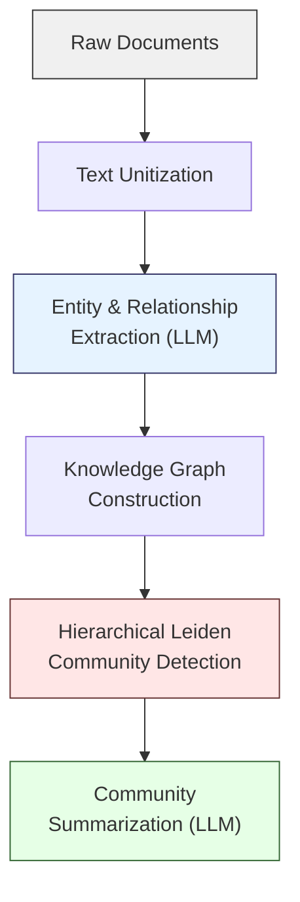
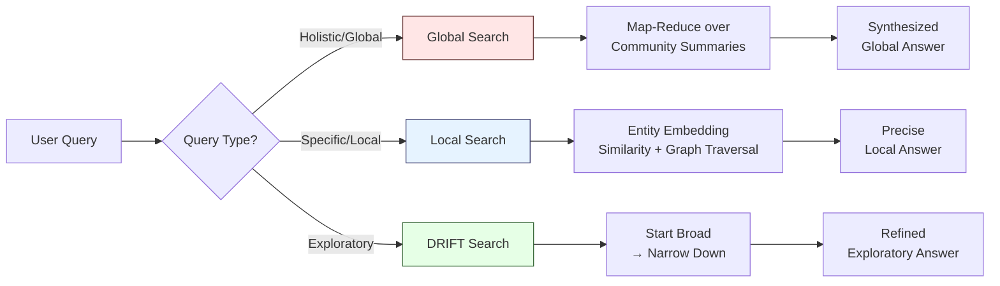

## From Chunks to Entities: A Paradigm Shift

Traditional RAG treats text chunks as the fundamental unit of knowledge. You split documents, embed chunks, and retrieve the most similar ones. This works well for specific, local questions -- but it fails catastrophically when someone asks a question like **"What are the main themes across this entire dataset?"**

GraphRAG, introduced by Microsoft Research, flips the paradigm. Instead of chunks as atoms, it uses **entities and relationships as atoms**. The result is a system that can answer both local and global questions with equal competence.

## The GraphRAG Indexing Pipeline

The indexing pipeline transforms raw text into a layered knowledge structure through five distinct stages.

### Stage 1: Text Unitization

Documents are broken into manageable text units (typically 300-token chunks with overlap). These are not the final retrieval units -- they serve as input windows for the LLM extraction step.

### Stage 2: Entity and Relationship Extraction

An LLM processes each text unit to extract named entities (people, organizations, concepts, locations) and the relationships between them. Each extraction includes a description and a strength score. Multiple mentions of the same entity across different chunks are merged through entity resolution.

### Stage 3: Knowledge Graph Construction

Extracted entities become nodes and relationships become edges in a knowledge graph. Entity descriptions from multiple sources are consolidated, creating rich node representations that synthesize information scattered across the entire corpus.

### Stage 4: Hierarchical Leiden Community Detection

This is what makes GraphRAG special. The Leiden algorithm partitions the graph into communities of densely connected entities at multiple hierarchical levels. Lower levels contain small, tightly-knit clusters; higher levels group those clusters into broader thematic communities. This hierarchy mirrors how information is naturally organized -- from specific details to broad themes.

### Stage 5: Community Summarization

An LLM generates a summary for each community at each level. These summaries capture the key entities, relationships, and themes within that community. They become the primary retrieval targets for global queries.

## Three Query Modes

GraphRAG supports three distinct retrieval strategies, each optimized for different question types.

### Global Search

For questions like "What are the main themes?" or "Summarize the key findings," Global Search performs a map-reduce operation over community summaries. Each summary is scored for relevance, the top summaries are selected, and the LLM synthesizes a comprehensive answer. This is the query mode that naive RAG simply cannot replicate.

### Local Search

For specific questions like "What did person X do at company Y?", Local Search identifies the most relevant entities via embedding similarity, then traverses the graph to gather neighboring entities, relationships, and linked text chunks. This combines vector similarity with structural graph context.

### DRIFT Search

DRIFT (Dynamic Reasoning and Inference with Flexible Traversal) is a hybrid approach. It begins with a broad community-level search to establish context, then progressively narrows down through follow-up queries that drill into specific subgraphs. It is particularly effective for exploratory or multi-faceted questions.

## Key Insight

The central innovation is that community detection and summarization create **pre-computed global context**. When you ask a holistic question, the system does not need to scan every chunk -- it already has thematic summaries at multiple levels of granularity. This is fundamentally impossible with flat vector retrieval, no matter how good your embeddings are.

## Cost Considerations

GraphRAG's power comes at a price. The indexing pipeline makes extensive LLM calls for entity extraction and community summarization. A moderately-sized corpus can consume millions of tokens during indexing. Query-time costs are also significant, especially for Global Search, which may process hundreds of community summaries per query.

> **Path Not Taken:** Building knowledge graphs manually using domain experts does not scale beyond small, controlled datasets. Alternatively, using only entity extraction without community detection preserves local relationships but loses the global context that makes GraphRAG distinctive -- you end up with a graph you can traverse locally but cannot summarize holistically.
