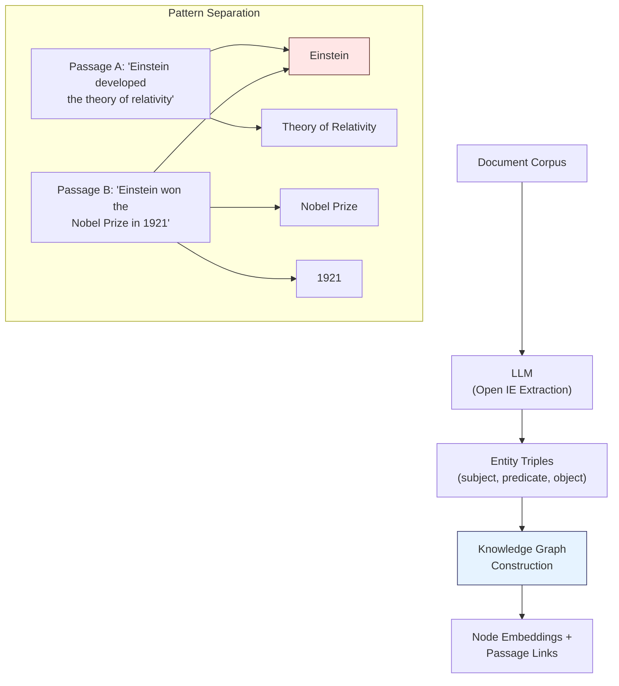
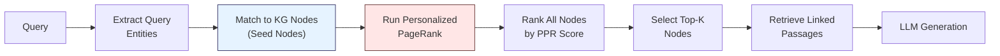
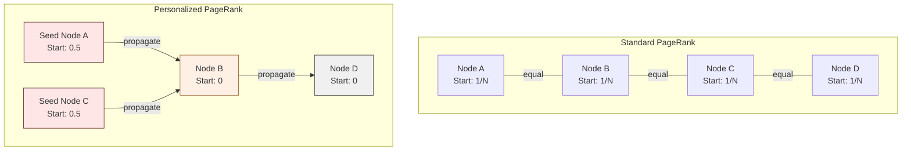
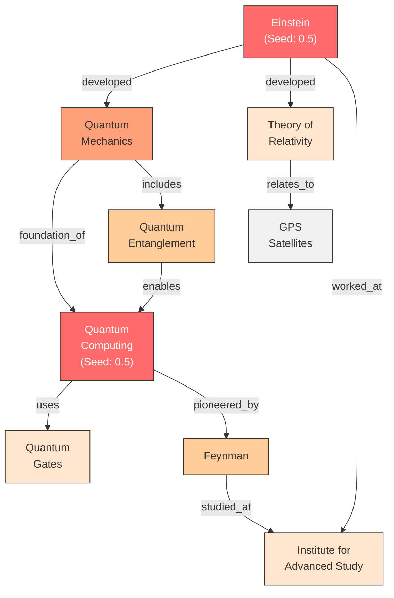

import SummaryBox from '../../../components/SummaryBox.astro';

<SummaryBox>

**HippoRAG mimics hippocampal memory: build a knowledge graph (pattern separation) → use Personalized PageRank to recover full context from query cues (pattern completion).**

**Key insight:** Like the brain, it creates shared indices (entity nodes) that bridge related memories (passages), enabling associative multi-hop retrieval.

**How PPR works:** Start from query entities → spread activation through the graph → nodes reachable via multiple short paths score highest → retrieve their linked passages.

**When to use:** Multi-hop questions, associative reasoning, when context is fragmented across documents.

**Trade-off:** Higher indexing cost (entity extraction + graph construction) but powerful retrieval.

</SummaryBox>

## Learning from the Brain

The human hippocampus does something remarkable: given a partial cue, it can retrieve complete memories by activating associated neural pathways. If you hear a few notes of a song, the hippocampus helps you reconstruct the full melody, the context where you heard it, and even how you felt at the time.

HippoRAG translates this mechanism into a RAG architecture. Instead of matching query embeddings to chunk embeddings (the standard approach), it builds a knowledge graph that functions as an associative memory index and uses **Personalized PageRank** to propagate activation from query cues through the graph, recovering complete contexts in a single step.

## Brain-to-Architecture Mapping

HippoRAG draws an explicit analogy between hippocampal memory components and computational modules:

| Brain Component | Memory Function | HippoRAG Module |
|---|---|---|
| **Neocortex** | Stores long-term memories, processes sensory input | LLM (extracts entities via Open Information Extraction) |
| **Parahippocampal Regions** | Filters input, detects synonymy, bridges to hippocampus | Retrieval encoders (embedding similarity for synonym detection) |
| **Hippocampus** | Creates memory indices, enables context-dependent retrieval | Knowledge Graph + Personalized PageRank |

This is not just a metaphor. The architectural decisions follow directly from the computational principles of hippocampal indexing theory.

## The Two Phases

### Phase 1: Offline Indexing (Pattern Separation)

In neuroscience, pattern separation is the process of creating distinct, orthogonal representations for similar inputs so they do not interfere with each other in memory. HippoRAG achieves this by decomposing passages into discrete entity nodes in a knowledge graph.

Each passage contributes entities and relationships to the shared graph. The same entity appearing in multiple passages creates a natural bridge between those memories -- exactly as the hippocampus creates shared indices for related experiences.

### Phase 2: Online Retrieval (Pattern Completion)

Pattern completion is the inverse of separation: given a partial cue, reconstruct the full context. This is where Personalized PageRank enters.

1. **Entity extraction**: The LLM extracts key entities from the query.
2. **Node matching**: Query entities are matched to KG nodes using embedding similarity (the parahippocampal analogue, handling synonymy and paraphrasing).
3. **PPR propagation**: Starting from matched seed nodes, Personalized PageRank spreads activation through the graph. Nodes reachable through multiple paths or short paths receive higher scores.
4. **Passage retrieval**: The top-K scored nodes are selected, and their linked passages are retrieved.
5. **Answer generation**: The LLM generates an answer from the retrieved passages.

## Multi-Hop Reasoning in a Single Step

This is HippoRAG's key advantage. Consider a multi-hop question: "What prize did the developer of the theory of relativity win?"

Standard RAG retrieves chunks about "theory of relativity" OR "prizes" but may never connect the two. Iterative approaches (like IRCoT) use multiple LLM calls to chain reasoning steps. HippoRAG solves this in a single PPR computation:

- Seed nodes: "theory of relativity," "prize"
- PPR spreads activation from both seeds simultaneously
- "Einstein" receives high scores from both directions (connected to both seeds)
- "Nobel Prize" receives activation through Einstein
- The relevant passages are retrieved without any iterative reasoning

## Performance

HippoRAG delivers strong results across multi-hop reasoning benchmarks:

- **Up to 20% improvement** over standard RAG baselines on multi-hop QA tasks
- **Matches iterative retrieval methods** (IRCoT) in answer quality
- **10-20x cheaper** than iterative methods (single retrieval pass vs. multiple LLM-guided iterations)
- Particularly strong on questions requiring **2-3 hop reasoning** across different passages

## Why It Works

The power of HippoRAG comes from encoding document relationships in graph structure rather than relying on embedding similarity alone. Two passages that share no lexical or semantic overlap but mention the same entity become connected through that shared node. PPR exploits this structural connectivity to find relevant information that vector similarity would miss entirely.

> **Path Not Taken:** Iterative retrieval with repeated LLM calls (IRCoT, Self-RAG, and similar approaches) can perform multi-hop reasoning by generating intermediate reasoning steps and retrieving new evidence at each step. This works, but each iteration requires a full LLM inference pass. For a 3-hop question, that means at least 3 retrieval-generation cycles. HippoRAG achieves equivalent reasoning through a single graph computation that completes in milliseconds, making it both cheaper and faster.

---

## Personalized PageRank: The Engine Behind HippoRAG

The retrieval phase of HippoRAG relies on Personalized PageRank (PPR). Understanding how PPR works — and why it differs from standard PageRank — is essential for understanding HippoRAG's power.

## From PageRank to Personalized PageRank

Google's original PageRank algorithm models a "random surfer" who clicks links at random, occasionally jumping to a completely random page. After enough time, the probability of the surfer being at any given page converges to a stable distribution -- pages with many incoming links from important pages rank highest. This treats all pages as equally valid starting points.

**Personalized PageRank (PPR)** changes one critical detail: the random surfer does not jump to a random page when they restart. Instead, they **always teleport back to a specific set of seed nodes**. This single change transforms a global importance algorithm into a **query-specific relevance algorithm**.

## The Core Mechanism

In standard PageRank, every node starts with equal probability (1/N). In PPR, all starting probability is concentrated on the seed nodes. The algorithm then iteratively distributes probability along edges:

At each iteration:
1. With probability **alpha** (the damping factor, typically 0.85), the surfer follows a random outgoing link from the current node, distributing its current score to neighbors.
2. With probability **(1 - alpha)** (typically 0.15), the surfer teleports back to a seed node, receiving a restart bonus proportional to its seed weight.
3. Scores are renormalized.

After convergence, nodes close to the seeds through strong, well-connected paths have high scores. Distant or weakly connected nodes have low scores.

## The Damping Factor (Alpha)

The damping factor alpha controls the balance between **exploring the broader graph** and **staying close to the seeds**.

- **High alpha (e.g., 0.85-0.95)**: The surfer rarely teleports back to seeds (only 5-15% of the time), so activation spreads widely through the graph. Good for discovering distant but relevant connections through multi-hop reasoning.
- **Low alpha (e.g., 0.5-0.7)**: The surfer frequently teleports back to seeds (30-50% of the time), keeping scores concentrated near the seed neighborhood. Good for precise, local retrieval.

For RAG applications, alpha values between 0.8 and 0.9 typically work well, allowing some exploration while maintaining connection to the query seeds.

## Worked Example: Multi-Hop Retrieval

### Setup

**Query:** "How did Einstein's work influence quantum computing?"

**Step 1: Extract entities from the query.**

Seed entities: `Einstein`, `quantum computing`

**Step 2: Map to KG nodes.**

Both entities exist as nodes in the knowledge graph. These become our seed nodes, each receiving a starting probability of 0.5.

**Step 3: Run PPR.**

**Step 4: Observe activation spread.**

After PPR converges (color intensity represents score):

| Node | PPR Score | Why |
|---|---|---|
| **Einstein** | 0.28 | Seed node |
| **Quantum Computing** | 0.25 | Seed node |
| **Quantum Mechanics** | 0.18 | Directly connected to BOTH seeds |
| **Quantum Entanglement** | 0.09 | Connected to both seeds via QM |
| **Feynman** | 0.07 | Connected to QC directly, to Einstein via IAS |
| **Theory of Relativity** | 0.05 | Connected to Einstein only |
| **Institute for Advanced Study** | 0.04 | Connected to both Einstein and Feynman |
| **Quantum Gates** | 0.02 | Connected only to QC |
| **GPS Satellites** | 0.01 | Far from both seeds |

**Step 5: Select top-K nodes and retrieve linked passages.**

The top-5 nodes (Einstein, Quantum Computing, Quantum Mechanics, Quantum Entanglement, Feynman) and their linked passages are retrieved. Notice that **Quantum Mechanics** scores highest among non-seed nodes because it sits on the path between both seeds -- it is the conceptual bridge between Einstein's work and quantum computing.

**Step 6: Generate answer.**

The LLM receives passages about Einstein's contributions to quantum mechanics, the foundations of quantum computing in quantum mechanical principles, and the role of quantum entanglement -- exactly the information needed to answer the multi-hop question.

## Why PPR Is Powerful for RAG

### Multi-hop in one step

A 3-hop connection (Einstein -> Quantum Mechanics -> Quantum Entanglement -> Quantum Computing) receives a non-zero PPR score in a single computation. No iterative LLM calls are needed to "chain" the reasoning.

### Structure-aware ranking

Not all paths are equal. A node reachable through multiple paths from the seeds scores higher than one reachable through a single path. This naturally prioritizes nodes that are structurally central to the query context.

### Computational efficiency

PPR converges in O(edges) time per iteration, with typically 10-20 iterations needed. For knowledge graphs with millions of edges, this completes in milliseconds -- orders of magnitude faster than a single LLM inference call.

## Comparison with Standard PageRank

| Property | Standard PageRank | Personalized PageRank |
|---|---|---|
| **Starting distribution** | Uniform across all nodes | Concentrated on seed nodes |
| **Teleport target** | Any random node | Only seed nodes |
| **Result interpretation** | Global importance | Query-specific relevance |
| **Use case** | Web search ranking | Context-specific retrieval |
| **Computational cost** | One computation for all queries | One computation per query (but fast) |
| **Sensitivity to query** | None (query-independent) | High (different seeds = different scores) |

## Beyond Simple PPR

Advanced variants extend the basic algorithm for RAG applications:

- **Weighted PPR**: Edge weights reflect relationship strength, so stronger relationships propagate more activation.
- **Typed PPR**: Different relationship types can have different propagation factors, allowing the algorithm to prefer certain types of reasoning paths.
- **Approximate PPR**: For very large graphs, algorithms like FORA and BiPPR compute approximate PPR scores efficiently without visiting the entire graph.

> **Path Not Taken:** Breadth-first search (BFS) from seed nodes is the simplest alternative for graph traversal. BFS finds all nodes within K hops of the seeds, but it treats every path equally -- a node reachable through a single weak connection scores the same as one reachable through five strong connections. PPR's probabilistic propagation naturally weights paths by graph structure, producing far more meaningful relevance scores. BFS also lacks a principled way to rank nodes at the same hop distance, while PPR produces a complete ranking over all reachable nodes.
