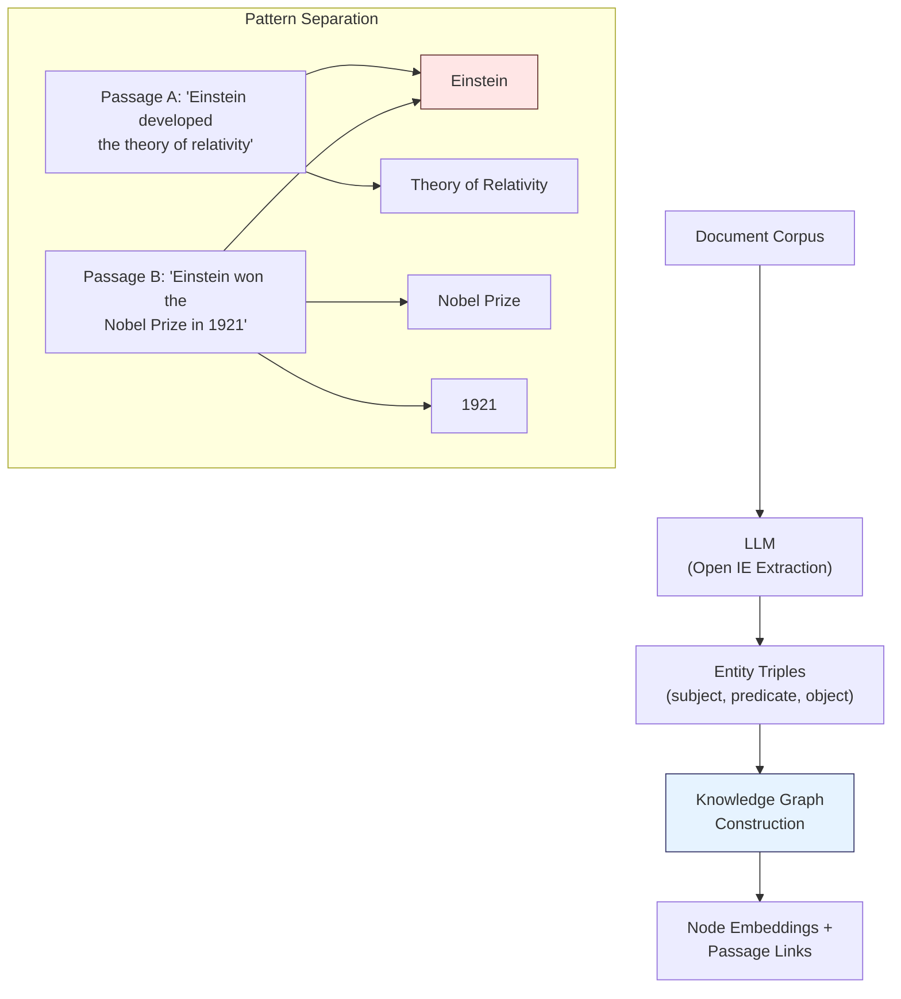
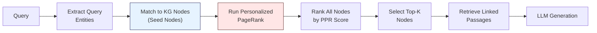

## Learning from the Brain

The human hippocampus does something remarkable: given a partial cue, it can retrieve complete memories by activating associated neural pathways. If you hear a few notes of a song, the hippocampus helps you reconstruct the full melody, the context where you heard it, and even how you felt at the time.

HippoRAG translates this mechanism into a RAG architecture. Instead of matching query embeddings to chunk embeddings (the standard approach), it builds a knowledge graph that functions as an associative memory index and uses **Personalized PageRank** to propagate activation from query cues through the graph, recovering complete contexts in a single step.

## Brain-to-Architecture Mapping

HippoRAG draws an explicit analogy between hippocampal memory components and computational modules:

| Brain Component | Memory Function | HippoRAG Module |
|---|---|---|
| **Neocortex** | Stores long-term memories, processes sensory input | LLM (extracts entities via Open Information Extraction) |
| **Parahippocampal Regions** | Filters input, detects synonymy, bridges to hippocampus | Retrieval encoders (embedding similarity for synonym detection) |
| **Hippocampus** | Creates memory indices, enables context-dependent retrieval | Knowledge Graph + Personalized PageRank |

This is not just a metaphor. The architectural decisions follow directly from the computational principles of hippocampal indexing theory.

## The Two Phases

### Phase 1: Offline Indexing (Pattern Separation)

In neuroscience, pattern separation is the process of creating distinct, orthogonal representations for similar inputs so they do not interfere with each other in memory. HippoRAG achieves this by decomposing passages into discrete entity nodes in a knowledge graph.

Each passage contributes entities and relationships to the shared graph. The same entity appearing in multiple passages creates a natural bridge between those memories -- exactly as the hippocampus creates shared indices for related experiences.

### Phase 2: Online Retrieval (Pattern Completion)

Pattern completion is the inverse of separation: given a partial cue, reconstruct the full context. This is where Personalized PageRank enters.

1. **Entity extraction**: The LLM extracts key entities from the query.
2. **Node matching**: Query entities are matched to KG nodes using embedding similarity (the parahippocampal analogue, handling synonymy and paraphrasing).
3. **PPR propagation**: Starting from matched seed nodes, Personalized PageRank spreads activation through the graph. Nodes reachable through multiple paths or short paths receive higher scores.
4. **Passage retrieval**: The top-K scored nodes are selected, and their linked passages are retrieved.
5. **Answer generation**: The LLM generates an answer from the retrieved passages.

## Multi-Hop Reasoning in a Single Step

This is HippoRAG's key advantage. Consider a multi-hop question: "What prize did the developer of the theory of relativity win?"

Standard RAG retrieves chunks about "theory of relativity" OR "prizes" but may never connect the two. Iterative approaches (like IRCoT) use multiple LLM calls to chain reasoning steps. HippoRAG solves this in a single PPR computation:

- Seed nodes: "theory of relativity," "prize"
- PPR spreads activation from both seeds simultaneously
- "Einstein" receives high scores from both directions (connected to both seeds)
- "Nobel Prize" receives activation through Einstein
- The relevant passages are retrieved without any iterative reasoning

## Performance

HippoRAG delivers strong results across multi-hop reasoning benchmarks:

- **Up to 20% improvement** over standard RAG baselines on multi-hop QA tasks
- **Matches iterative retrieval methods** (IRCoT) in answer quality
- **10-20x cheaper** than iterative methods (single retrieval pass vs. multiple LLM-guided iterations)
- Particularly strong on questions requiring **2-3 hop reasoning** across different passages

## Why It Works

The power of HippoRAG comes from encoding document relationships in graph structure rather than relying on embedding similarity alone. Two passages that share no lexical or semantic overlap but mention the same entity become connected through that shared node. PPR exploits this structural connectivity to find relevant information that vector similarity would miss entirely.

> **Path Not Taken:** Iterative retrieval with repeated LLM calls (IRCoT, Self-RAG, and similar approaches) can perform multi-hop reasoning by generating intermediate reasoning steps and retrieving new evidence at each step. This works, but each iteration requires a full LLM inference pass. For a 3-hop question, that means at least 3 retrieval-generation cycles. HippoRAG achieves equivalent reasoning through a single graph computation that completes in milliseconds, making it both cheaper and faster.
