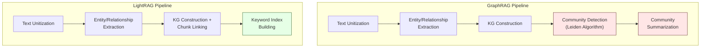
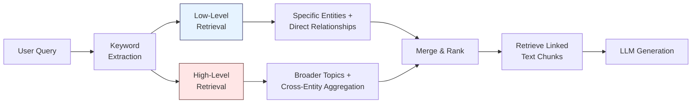

import SummaryBox from '../../../components/SummaryBox.astro';

<SummaryBox>

**LightRAG keeps GraphRAG's knowledge graph but eliminates expensive community detection and summarization.**

**How it works:** Extract entities → build graph → use dual-level retrieval (entity-level + chunk-level) → deduplicate entities across chunks to maintain relationships.

**Key innovation:** Entity deduplication solves context loss without preprocessing overhead. Same "Einstein" in different chunks = single graph node.

**When to use:** When you want graph benefits (entity relationships, context recovery) without GraphRAG's cost (~610K tokens/query for global search).

**Trade-off:** No global queries, but much cheaper and faster for local/hybrid queries while maintaining structural awareness.

</SummaryBox>

## The Cost Problem with GraphRAG

GraphRAG is powerful, but its Global Search mode consumes approximately **610,000 tokens per query** on moderately-sized corpora. This is because it must process hundreds of community summaries through a map-reduce pipeline before synthesizing a final answer. For many production use cases, this cost is prohibitive.

LightRAG asks a sharp question: **can we get the benefits of graph-based RAG without the expensive community detection and summarization steps?** The answer, surprisingly, is mostly yes.

## How LightRAG Simplifies the Pipeline

LightRAG strips GraphRAG down to its essentials. It keeps the knowledge graph construction but eliminates the hierarchical community detection and pre-computed community summaries entirely.

The key differences:

1. **No community detection** -- the graph is used directly, without partitioning into communities.
2. **No community summarization** -- eliminates the expensive LLM calls that generate summaries for each community at each hierarchical level.
3. **Hybrid keyword + embedding retrieval** -- LightRAG extracts keywords from queries and matches them against entities and relationships using both lexical matching and embedding similarity (for synonym handling).
4. **Chunk linking** -- each entity and relationship in the graph maintains links back to the original text chunks, enabling direct source retrieval.

## Dual-Level Retrieval

LightRAG's central innovation is its **dual-level retrieval** strategy, which addresses both specific and abstract questions without requiring community summaries.

### Low-Level Retrieval

Low-level retrieval targets **specific entities and their direct relationships**. When a user asks "Who wrote the Theory of Relativity?", the system extracts keywords like "Theory of Relativity" and "wrote," matches them to specific entity nodes and relationship edges, then retrieves the immediately connected subgraph and its linked text chunks.

This mode excels at precise, factual questions where the answer lives in a small neighborhood of the graph.

### High-Level Retrieval

High-level retrieval targets **broader topics and themes** by aggregating across multiple entities. When a user asks "What are the key challenges in renewable energy?", the system extracts thematic keywords and matches them across a wider set of entities and relationships. By collecting information from many parts of the graph, it approximates the global view that GraphRAG achieves through community summaries.

This mode handles abstract questions by casting a wider net across the graph structure.

## Query Processing Step by Step

1. **Keyword extraction**: The LLM extracts both specific entity keywords and broader thematic keywords from the query.
2. **Graph matching**: Keywords are matched against entity names, relationship descriptions, and associated metadata in the KG.
3. **Subgraph retrieval**: Matching entities and their local neighborhoods are extracted at both low and high levels.
4. **Chunk retrieval**: Text chunks linked to the retrieved entities and relationships are gathered.
5. **Generation**: The LLM synthesizes an answer from the retrieved chunks, with graph structure providing organizational context.

## Cost Comparison

| Metric | GraphRAG (Global) | LightRAG |
|---|---|---|
| **Tokens per query** | ~610,000 | fewer than 100 (retrieval) + generation |
| **Indexing LLM calls** | Entity extraction + community summarization | Entity extraction only |
| **Query latency** | High (map-reduce over summaries) | Low (keyword matching) |
| **Global question quality** | Excellent | Good (via high-level retrieval) |
| **Local question quality** | Excellent | Excellent |
| **Incremental updates** | Expensive (re-run community detection) | Cheap (add new nodes/edges) |

The token reduction at query time is dramatic -- from hundreds of thousands to fewer than a hundred for the retrieval step itself. The trade-off is that LightRAG's high-level retrieval is an approximation of true global understanding rather than a pre-computed synthesis.

## When to Choose LightRAG

LightRAG is the right choice when:

- **Cost constraints** make GraphRAG's token consumption impractical
- **Incremental updates** are frequent (LightRAG handles new data without recomputing communities)
- **Most queries are specific** with only occasional global questions
- **Low latency** is a hard requirement

GraphRAG remains superior when global, holistic questions are the primary use case and cost is not a binding constraint.

> **Path Not Taken:** An intermediate approach would keep community summaries but simplify only the graph construction. However, this preserves the most expensive component -- community summarization at indexing time and summary processing at query time -- while saving relatively little on the cheaper graph construction step. LightRAG correctly identifies community detection and summarization as the bottleneck and removes them entirely.
