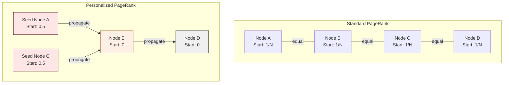
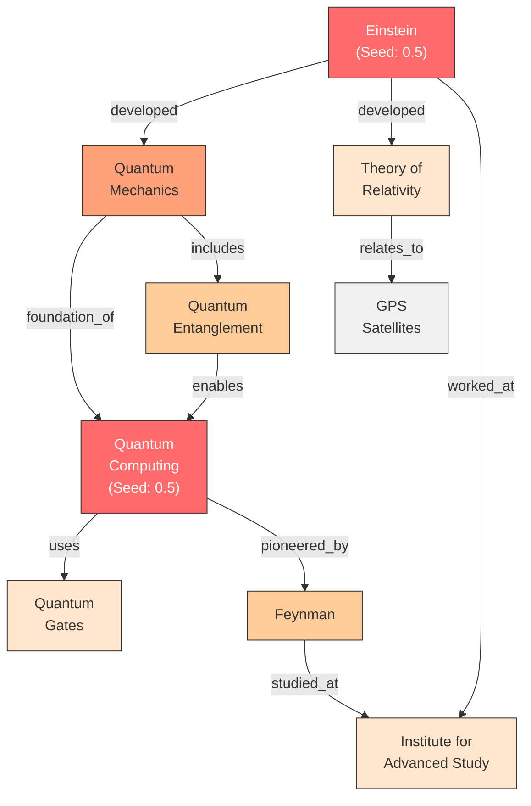

## From PageRank to Personalized PageRank

Google's original PageRank algorithm models a "random surfer" who clicks links at random, occasionally jumping to a completely random page. After enough time, the probability of the surfer being at any given page converges to a stable distribution -- pages with many incoming links from important pages rank highest. This treats all pages as equally valid starting points.

**Personalized PageRank (PPR)** changes one critical detail: the random surfer does not jump to a random page when they restart. Instead, they **always teleport back to a specific set of seed nodes**. This single change transforms a global importance algorithm into a **query-specific relevance algorithm**.

## The Core Mechanism

In standard PageRank, every node starts with equal probability (1/N). In PPR, all starting probability is concentrated on the seed nodes. The algorithm then iteratively distributes probability along edges:

At each iteration:
1. Each node distributes a fraction (1 - alpha) of its current score to its neighbors along outgoing edges.
2. Each node receives a "teleport" bonus of alpha times its seed weight (alpha is the damping factor, typically ~0.85).
3. Scores are renormalized.

After convergence, nodes close to the seeds through strong, well-connected paths have high scores. Distant or weakly connected nodes have low scores.

## The Damping Factor (Alpha)

The damping factor alpha controls the balance between **staying close to the seeds** and **exploring the broader graph**.

- **High alpha (e.g., 0.85-0.95)**: The surfer teleports back to seeds frequently. Scores are concentrated near the seed neighborhood. Good for precise, local retrieval.
- **Low alpha (e.g., 0.5-0.7)**: The surfer explores further before teleporting. Scores spread more broadly. Good for discovering distant but relevant connections.

For RAG applications, alpha values between 0.8 and 0.9 typically work well, balancing precision with the ability to reach multi-hop connections.

## Worked Example: Multi-Hop Retrieval

### Setup

**Query:** "How did Einstein's work influence quantum computing?"

**Step 1: Extract entities from the query.**

Seed entities: `Einstein`, `quantum computing`

**Step 2: Map to KG nodes.**

Both entities exist as nodes in the knowledge graph. These become our seed nodes, each receiving a starting probability of 0.5.

**Step 3: Run PPR.**

**Step 4: Observe activation spread.**

After PPR converges (color intensity represents score):

| Node | PPR Score | Why |
|---|---|---|
| **Einstein** | 0.28 | Seed node |
| **Quantum Computing** | 0.25 | Seed node |
| **Quantum Mechanics** | 0.18 | Directly connected to BOTH seeds |
| **Quantum Entanglement** | 0.09 | Connected to both seeds via QM |
| **Feynman** | 0.07 | Connected to QC directly, to Einstein via IAS |
| **Theory of Relativity** | 0.05 | Connected to Einstein only |
| **Institute for Advanced Study** | 0.04 | Connected to both Einstein and Feynman |
| **Quantum Gates** | 0.02 | Connected only to QC |
| **GPS Satellites** | 0.01 | Far from both seeds |

**Step 5: Select top-K nodes and retrieve linked passages.**

The top-5 nodes (Einstein, Quantum Computing, Quantum Mechanics, Quantum Entanglement, Feynman) and their linked passages are retrieved. Notice that **Quantum Mechanics** scores highest among non-seed nodes because it sits on the path between both seeds -- it is the conceptual bridge between Einstein's work and quantum computing.

**Step 6: Generate answer.**

The LLM receives passages about Einstein's contributions to quantum mechanics, the foundations of quantum computing in quantum mechanical principles, and the role of quantum entanglement -- exactly the information needed to answer the multi-hop question.

## Why PPR Is Powerful for RAG

### Multi-hop in one step

A 3-hop connection (Einstein -> Quantum Mechanics -> Quantum Entanglement -> Quantum Computing) receives a non-zero PPR score in a single computation. No iterative LLM calls are needed to "chain" the reasoning.

### Structure-aware ranking

Not all paths are equal. A node reachable through multiple paths from the seeds scores higher than one reachable through a single path. This naturally prioritizes nodes that are structurally central to the query context.

### Computational efficiency

PPR converges in O(edges) time per iteration, with typically 10-20 iterations needed. For knowledge graphs with millions of edges, this completes in milliseconds -- orders of magnitude faster than a single LLM inference call.

## Comparison with Standard PageRank

| Property | Standard PageRank | Personalized PageRank |
|---|---|---|
| **Starting distribution** | Uniform across all nodes | Concentrated on seed nodes |
| **Teleport target** | Any random node | Only seed nodes |
| **Result interpretation** | Global importance | Query-specific relevance |
| **Use case** | Web search ranking | Context-specific retrieval |
| **Computational cost** | One computation for all queries | One computation per query (but fast) |
| **Sensitivity to query** | None (query-independent) | High (different seeds = different scores) |

## Beyond Simple PPR

Advanced variants extend the basic algorithm for RAG applications:

- **Weighted PPR**: Edge weights reflect relationship strength, so stronger relationships propagate more activation.
- **Typed PPR**: Different relationship types can have different propagation factors, allowing the algorithm to prefer certain types of reasoning paths.
- **Approximate PPR**: For very large graphs, algorithms like FORA and BiPPR compute approximate PPR scores efficiently without visiting the entire graph.

> **Path Not Taken:** Breadth-first search (BFS) from seed nodes is the simplest alternative for graph traversal. BFS finds all nodes within K hops of the seeds, but it treats every path equally -- a node reachable through a single weak connection scores the same as one reachable through five strong connections. PPR's probabilistic propagation naturally weights paths by graph structure, producing far more meaningful relevance scores. BFS also lacks a principled way to rank nodes at the same hop distance, while PPR produces a complete ranking over all reachable nodes.
