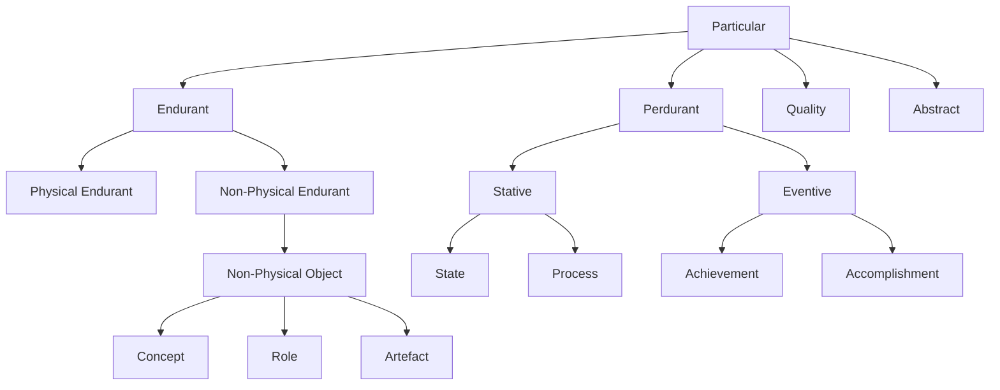
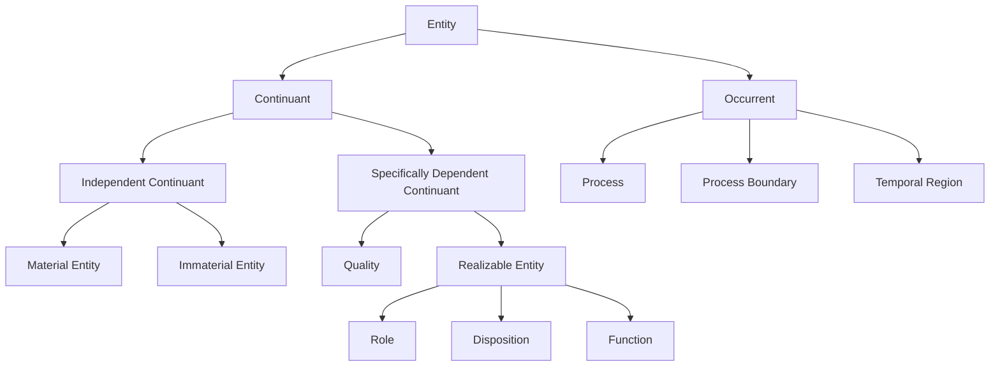
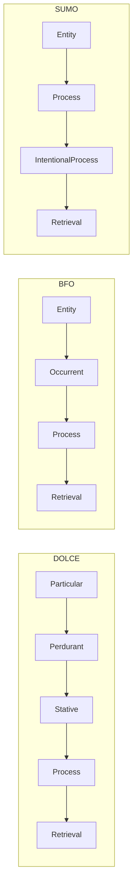

import CrossReference from '../../../components/CrossReference.astro';
import PathNotTaken from '../../../components/PathNotTaken.astro';
import DiagramBlock from '../../../components/DiagramBlock.astro';
import ComparisonTable from '../../../components/ComparisonTable.astro';
import SummaryBox from '../../../components/SummaryBox.astro';

# Foundational Ontologies for RAG

<SummaryBox>

**Foundational ontologies provide top-level categories and constraints for domain ontologies. Three major options: DOLCE, BFO, and SUMO.**

**DOLCE (Descriptive Ontology for Linguistic and Cognitive Engineering):**
- Cognitive/descriptive approach
- Endurants vs. perdurants distinction
- Best for: AI/NLP applications

**BFO (Basic Formal Ontology):**
- Realist/scientific approach
- Continuants vs. occurrents (similar to endurants/perdurants)
- Best for: Scientific/biomedical domains

**SUMO (Suggested Upper Merged Ontology):**
- Comprehensive, includes processes, objects, abstract entities
- IEEE standard
- Best for: General-purpose reasoning

**Why choose one:** Provides shared vocabulary, formal constraints, and interoperability with other ontologies in the same foundation.

</SummaryBox>

## Why Anchor to a Foundation?

The <CrossReference slug="04-rag-ontology/rag-ontology-map" /> maps RAG concepts to DOLCE categories. But DOLCE is not the only foundational ontology. **BFO** and **SUMO** offer different categorization schemes — and the choice affects how you model, reason about, and extend the RAG ontology.

A foundational ontology provides:
- **Shared vocabulary** for cross-domain interoperability
- **Formal constraints** that prevent modeling errors
- **Philosophical grounding** that distinguishes types from roles, things from processes

## The Three Major Foundational Ontologies

### DOLCE (Descriptive Ontology for Linguistic and Cognitive Engineering)

Developed at the Laboratory for Applied Ontology (LOA-CNR, Italy). DOLCE is **cognitively oriented** — it models the categories underlying human language and thought.

<DiagramBlock caption="DOLCE top-level categories relevant to RAG" label="DOLCE hierarchy">

</DiagramBlock>

**Key strengths for RAG**:
- Rich **non-physical endurant** hierarchy — documents and chunks are information artefacts, naturally modeled as non-physical objects
- **Role** as a first-class category — Retriever, Generator, and Indexer are roles played by components, not essential types
- Four-way **process taxonomy** (State, Process, Achievement, Accomplishment) — captures the difference between ongoing retrieval and completed query sessions

### BFO (Basic Formal Ontology)

Developed by Barry Smith. BFO is **realist and minimal** (only 34 terms). It's an ISO standard (ISO/IEC 21838-2) and the backbone of the OBO Foundry biomedical ontologies.

<DiagramBlock caption="BFO top-level categories relevant to RAG" label="BFO hierarchy">

</DiagramBlock>

**Key strengths for RAG**:
- **Realizable Entity** hierarchy distinguishes Role, Disposition, and Function — a Retriever's *function* (what it's designed for), *disposition* (capacity to retrieve), and *role* (context-dependent status) are all distinct concepts
- Minimal and rigorous — forces you to justify every category
- ISO standard with strong tooling ecosystem

### SUMO (Suggested Upper Merged Ontology)

Developed by Adam Pease et al. SUMO is **larger and more expressive** than DOLCE or BFO, with rich axioms in first-order logic and links to WordNet.

**Key strengths for RAG**:
- **InformationBearingObject** hierarchy cleanly separates content (information) from medium (storage)
- **IntentionalProcess** captures that RAG generation is purposeful, not random
- **Communication** models the query-response pattern as a communicative act

## Head-to-Head Comparison

<ComparisonTable
  columns={["Criterion", "DOLCE", "BFO", "SUMO"]}
  filterColumn="Criterion"
  rows={[
    ["Information objects", "Excellent (non-physical artefact)", "Good (generically dependent continuant)", "Excellent (InformationBearingObject)"],
    ["Process taxonomy", "Excellent (4 types: state/process/achievement/accomplishment)", "Good (Process + ProcessBoundary)", "Good (Process hierarchy)"],
    ["Role modeling", "Excellent (Role as non-physical endurant)", "Excellent (Role as realizable entity)", "Moderate (less formal treatment)"],
    ["Formalism", "OWL-DL, FOL", "OWL-DL, ISO standard", "FOL (Sigma KIF)"],
    ["Size", "Medium (~100 categories)", "Minimal (34 terms)", "Large (25,000+ terms)"],
    ["Primary domain", "Language, cognition, social", "Biomedical, scientific", "General-purpose"],
    ["Tooling/adoption", "Moderate", "High (OBO Foundry)", "Moderate"],
    ["Cognitive alignment", "Highest", "Low (strict realist)", "Moderate"],
  ]}
/>

## Same Concept, Different Categorizations

How does "Retrieval" look in each framework?

<DiagramBlock caption="Retrieval mapped across three foundational ontologies" label="Retrieval across ontologies">

</DiagramBlock>

| Aspect | DOLCE | BFO | SUMO |
|--------|-------|-----|------|
| Category for Retrieval | Stative Process | Occurrent Process | IntentionalProcess |
| What it captures | Ongoing, cumulative activity | Something with temporal parts | Purposeful computational action |
| Distinction from QuerySession | Process vs Accomplishment (cumulative vs telic) | Process vs Process (less fine-grained) | Process vs Process (distinguished by axioms) |

DOLCE's four-way perdurant distinction is the most expressive here — it captures that Retrieval is cumulative (two retrievals composed = still retrieval) while QuerySession is an accomplishment (it has a natural endpoint).

## How "Document" Maps Differently

| Aspect | DOLCE | BFO | SUMO |
|--------|-------|-----|------|
| Category | Non-physical Artefact | Generically Dependent Continuant | InformationBearingObject |
| Key insight | A designed information object | Exists by virtue of being concretized in a medium | Content separable from medium |
| Implication | Focus on document as cultural/social artefact | Focus on document's dependence on physical storage | Focus on information content vs physical carrier |

## Which Foundation for RAG?

<PathNotTaken title="Building a RAG ontology without any foundational ontology" reason="Without a foundation, you lack formal constraints on your categories. You might accidentally make 'RetrievedChunk' a subclass of 'DocumentChunk' (violating rigidity constraints), or model 'Retrieval' as an entity instead of a process. Foundational ontologies prevent these structural errors." />

**Our recommendation: DOLCE** for RAG ontology design, because:

1. **Information objects are first-class citizens** — documents, chunks, and embeddings are non-physical artefacts, which DOLCE models natively
2. **Rich process taxonomy** — the State/Process/Achievement/Accomplishment distinction maps perfectly to RAG's mix of ongoing processes and discrete events
3. **Role as a formal category** — Retriever, Generator, Indexer as roles (not types) is naturally expressed in DOLCE
4. **Cognitive alignment** — since RAG is ultimately about human-AI interaction, DOLCE's cognitive orientation is appropriate

**When to consider BFO instead**: If your RAG system is part of a scientific data pipeline (e.g., biomedical literature retrieval) and needs to interoperate with OBO Foundry ontologies.

**When to consider SUMO instead**: If you need extremely detailed axioms for automated reasoning, or if your RAG system processes multi-modal content where the content/medium distinction matters.

## Bringing It All Together

The journey through this section:

1. <CrossReference slug="04-rag-ontology/ontology" /> introduced endurants and perdurants
2. <CrossReference slug="04-rag-ontology/competency-questions" /> showed how to ask the right questions
3. <CrossReference slug="04-rag-ontology/rag-ontology-map" /> derived the complete RAG ontology from those questions
4. This page compared which foundational ontology best anchors that derivation

The ontology is not just an academic exercise — it provides the formal structure that <CrossReference slug="03-graph-rag/graphrag" /> uses when extracting entities and relationships from documents.

## What's Next

With the full ontological picture in hand, move to <CrossReference slug="05-synthesis/progressive-map" /> for a visual synthesis of everything we've covered — from naive RAG through graph-based approaches to ontological engineering.
