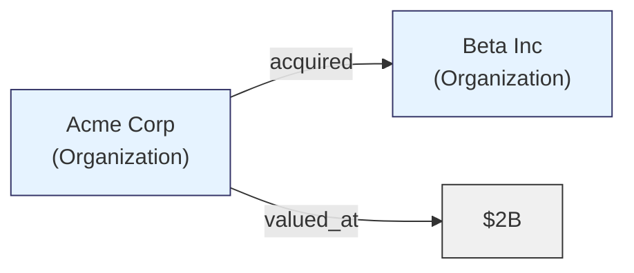
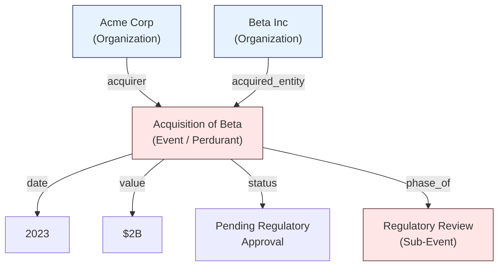

import SummaryBox from '../../../components/SummaryBox.astro';
import CrossReference from '../../../components/CrossReference.astro';

<SummaryBox>

**Formal ontology distinguishes two fundamental categories: endurants (things that persist, like people or documents) and perdurants (things that unfold over time, like processes or events).**

**Why this matters for RAG:** Most knowledge graphs only capture endurants (entities), losing temporal and processual information. Understanding this distinction helps you model richer graphs.

**Key insight:** An "embedding" is an endurant (an object), but "embedding a document" is a perdurant (a process). GraphRAG typically extracts only endurants.

**When to care:** When your domain involves processes, events, or temporal sequences—not just static entities and relationships.

</SummaryBox>

## Why Formal Ontology After Practical Graphs?

You have now seen three graph-based RAG systems (<CrossReference slug="03-graph-rag/graphrag" />, <CrossReference slug="03-graph-rag/lightrag" />, and <CrossReference slug="03-graph-rag/hipporag" />). Each builds a knowledge graph by extracting entities and relationships from text using LLMs. But none of them asks a crucial question: **what kinds of things should be in the graph?**

They extract whatever the LLM identifies as "entities" — but this implicit, ad-hoc ontology has systematic blind spots. For instance, all three systems extract **nouns** (people, places, documents) but systematically ignore **processes** (indexing, retrieval, embedding generation). The distinction between things that persist (like a document) and things that unfold over time (like a retrieval operation) is never explicitly modeled.

This section examines those blind spots through the lens of formal ontology. By understanding **what categories of entities exist** and **how they differ ontologically**, we can build knowledge graphs that capture not just entities and static relationships, but also temporal processes, dependencies, and change over time.

## The Two Kinds of Things in the World

When we build knowledge graphs, we make implicit ontological commitments about what exists and how it is categorized. The most fundamental distinction in formal ontology divides everything into two categories: **endurants** (things that persist wholly at any moment in time) and **perdurants** (things that unfold over time, having temporal parts).

Understanding this distinction is critical for building knowledge graphs that faithfully represent reality -- and for understanding why most graph-based RAG systems systematically lose certain types of information.

## Endurants: What Persists

Endurants are entities that are wholly present at every moment of their existence. At any given instant, the entire entity is "there." These include:

- **Physical objects**: people, buildings, machines, documents
- **Organizations**: companies, governments, teams
- **Abstract concepts**: theories, policies, standards
- **Qualities and properties**: color, weight, reputation

A person, for example, is fully present right now. You do not have "part of a person" existing today and another part tomorrow. The person may change over time, but at each moment, the whole person exists.

## Perdurants: What Unfolds

Perdurants are entities that extend through time, having distinct temporal parts. They include:

- **Events**: an acquisition, a product launch, an election
- **Processes**: manufacturing, research, litigation
- **States**: a recession, a partnership, a conflict

An acquisition, for instance, is not wholly present at any single moment. It has phases -- negotiation, agreement, regulatory approval, completion. Each phase is a temporal part of the whole event.

## Why Perdurants Are Systematically Overlooked

Traditional knowledge graph extraction is overwhelmingly **entity-centric**. Most NLP pipelines prioritize noun phrases as entities and reduce verbs to mere edge labels. Consider the sentence:

*"Acme Corp acquired Beta Inc in 2023 for $2B, pending regulatory approval."*

### The Entity-Only Graph (Typical)

In this representation, the acquisition is flattened to a relationship label. Its properties -- the date, the price, the regulatory status, the consequences -- either dangle awkwardly from the edge or are lost entirely. You cannot ask "What acquisitions are pending regulatory approval?" because "pending regulatory approval" has nowhere to live in this schema.

### The Entity + Event Graph (Ontologically Aware)

Now the acquisition is a **first-class node** -- a perdurant with its own properties, sub-events, temporal boundaries, and causal connections. Queries about event properties, timelines, and causal chains become straightforward graph traversals.

## What Gets Lost Without Perdurants

When perdurants are flattened into edge labels, several categories of information are systematically destroyed:

| Lost Information | Example |
|---|---|
| **Event properties** | The acquisition price, terms, conditions |
| **Temporal structure** | Phases, duration, sequence of sub-events |
| **Causal chains** | Event A caused Event B which led to State C |
| **Event participation roles** | Who was the buyer, seller, regulator, advisor |
| **Counterfactuals** | What would have happened if the acquisition failed |

## Event Knowledge Graphs (EKGs)

Event Knowledge Graphs treat events as first-class citizens alongside entities. In an EKG, both endurants and perdurants are nodes, connected by participation and temporal relationships. This design supports queries like:

- "What events preceded the company's bankruptcy?"
- "Which people participated in both the merger and the lawsuit?"
- "What processes were disrupted by the regulation change?"

EKGs are particularly valuable in domains with rich temporal dynamics: finance, geopolitics, healthcare, and legal analysis.

## Implications for Graph-Based RAG

If your knowledge graph only captures endurants, your RAG system will excel at answering entity-centric questions ("Who is the CEO of X?" or "What products does Y make?") but struggle with process-oriented or causal questions ("How did the financial crisis unfold?" or "What led to the policy change?").

When designing a graph-based RAG system, the ontological choices you make during extraction directly determine the space of questions your system can answer.

> **Path Not Taken:** Ignoring ontological distinctions entirely and treating all extracted elements as flat, undifferentiated entities is the default approach in most graph-based RAG systems today. This works adequately for static, entity-centric queries but creates a systematic blind spot for temporal, causal, and process-oriented reasoning -- precisely the kind of complex questions that motivate building a knowledge graph in the first place.
