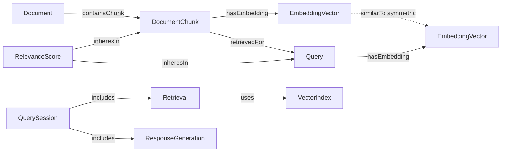

import CrossReference from '../../../components/CrossReference.astro';
import PathNotTaken from '../../../components/PathNotTaken.astro';
import DiagramBlock from '../../../components/DiagramBlock.astro';
import ComparisonTable from '../../../components/ComparisonTable.astro';
import SummaryBox from '../../../components/SummaryBox.astro';

# RAG Ontology Map

<SummaryBox>

**This page presents a complete formal ontology of RAG concepts, grounded in DOLCE foundational categories and derived from Competency Questions.**

**What it includes:**
- **Endurants:** Documents, chunks, embeddings, indexes, models (things that persist)
- **Perdurants:** Indexing, retrieval, generation, embedding (processes that unfold)
- **Qualities:** Semantic similarity, relevance, coherence
- **Relationships:** participates_in, produces, uses, represents

**Why formalize this:** Enables precise reasoning about RAG systems, identifies missing concepts, supports interoperability between different RAG frameworks.

**Use this page to:** Understand the complete conceptual structure of RAG from a formal ontology perspective.

</SummaryBox>

## From Questions to Structure

The <CrossReference slug="04-rag-ontology/competency-questions" /> showed us how to ask the right questions. Now we answer them — producing a formal ontology of RAG concepts grounded in DOLCE foundational categories.

Every entity below was justified by a specific Competency Question. This is not a brainstormed list — it's a systematically derived model.

## The Complete RAG Ontology

```mermaid
flowchart TD
    P["DOLCE: Particular"] --> E["Endurant<br/><i>wholly present at any moment</i>"]
    P --> PD["Perdurant<br/><i>unfolds through time</i>"]
    P --> Q["Quality<br/><i>measurable property</i>"]
    P --> A["Abstract<br/><i>no spatiotemporal location</i>"]

    E --> NPA["Non-Physical Artefact"]
    E --> RL["Role<br/><i>anti-rigid</i>"]

    NPA --> Doc["Document<br/>rigid"]
    NPA --> Chunk["DocumentChunk<br/>rigid"]
    NPA --> VI["VectorIndex<br/>rigid"]
    NPA --> EM["EmbeddingModel<br/>rigid"]
    NPA --> LM["LanguageModel<br/>rigid"]
    NPA --> RS2["RAGSystem<br/>rigid"]
    NPA --> DC["DocumentCorpus<br/>rigid, unified"]

    RL --> RR["Retriever Role"]
    RL --> GR["Generator Role"]
    RL --> IR["Indexer Role"]

    PD --> Proc["Process<br/><i>stative</i>"]
    PD --> Acc["Accomplishment<br/><i>non-atomic event</i>"]

    Proc --> Ing["Ingestion"]
    Proc --> Ret["Retrieval"]

    Acc --> QS["QuerySession"]
    Acc --> EG["EmbeddingGeneration"]
    Acc --> RG["ResponseGeneration"]
    Acc --> IU["IndexUpdate"]

    Q --> RS["RelevanceScore<br/>dependent"]
    Q --> ED["EmbeddingDistance<br/>dependent"]

    A --> EV["EmbeddingVector"]
    A --> Qry["Query"]

    style E fill:#e1f5fe
    style NPA fill:#e1f5fe
    style RL fill:#e1f5fe
    style PD fill:#fff3e0
    style Proc fill:#fff3e0
    style Acc fill:#fff3e0
    style Q fill:#e8f5e9
    style A fill:#f3e5f5
```

<DiagramBlock caption="RAG concepts classified under DOLCE foundational categories" label="Complete RAG ontology class diagram">

</DiagramBlock>

## Entity-by-Entity Breakdown

### Endurants: Things That Persist

These are RAG entities that exist **wholly at any moment**. You can point to them and say "that exists right now."

<ComparisonTable
  columns={["Entity", "Category", "Rigidity", "Justified By"]}
  filterColumn="Category"
  rows={[
    ["Document", "Non-physical Artefact", "+R (rigid)", "SCQ-1: What types of documents form a corpus?"],
    ["DocumentChunk", "Non-physical Artefact", "+R (rigid)", "SCQ-1: What units are retrieved?"],
    ["VectorIndex", "Non-physical Artefact", "+R (rigid)", "SCQ-2: What stores embeddings?"],
    ["EmbeddingModel", "Non-physical Artefact", "+R (rigid)", "SCQ-2: What converts text to vectors?"],
    ["LanguageModel", "Non-physical Artefact", "+R (rigid)", "SCQ-2: What generates responses?"],
    ["RAGSystem", "Non-physical Artefact", "+R (rigid)", "SCQ-2: What is the whole pipeline?"],
    ["DocumentCorpus", "Non-physical Artefact", "+R (rigid), +U", "SCQ-1: What collection do docs belong to?"],
    ["Retriever", "Role", "~R (anti-rigid)", "MpCQ: Can a component stop being a retriever?"],
    ["Generator", "Role", "~R (anti-rigid)", "MpCQ: Can a component stop being a generator?"],
    ["Indexer", "Role", "~R (anti-rigid)", "MpCQ: Can a component stop being an indexer?"],
  ]}
/>

**Why roles matter**: The same software component can play the Retriever role in one pipeline configuration and a different role in another. Marking these as anti-rigid (~R) prevents the mistake of treating "Retriever" as an essential type.

### Perdurants: Things That Happen

These are RAG events and processes that **unfold through time**. You cannot observe the whole thing at a single instant.

<ComparisonTable
  columns={["Entity", "Category", "Type", "Justified By"]}
  filterColumn="Type"
  rows={[
    ["Ingestion", "Process", "Stative (ongoing)", "FCQ-2: Does ingestion unfold in time?"],
    ["Retrieval", "Process", "Stative (ongoing)", "FCQ-2: Does retrieval unfold in time?"],
    ["QuerySession", "Accomplishment", "Non-atomic event", "FCQ-6: Is a query session atomic or structured?"],
    ["EmbeddingGeneration", "Accomplishment", "Non-atomic event", "FCQ-2: Does embedding generation have phases?"],
    ["ResponseGeneration", "Accomplishment", "Non-atomic event", "FCQ-2: Does response generation have phases?"],
    ["IndexUpdate", "Accomplishment", "Non-atomic event", "FCQ-2: Does index update have phases?"],
  ]}
/>

**Why the distinction between Process and Accomplishment?** Processes (like Retrieval) are cumulative — two retrieval operations composed are still retrieval. Accomplishments (like QuerySession) are non-atomic events with a natural endpoint — the session completes when a response is returned.

### Qualities: Measurable Properties

Qualities **inhere in** other entities. They cannot exist independently.

| Entity | Inheres In | Dependence | Justified By |
|--------|-----------|------------|--------------|
| RelevanceScore | Query + DocumentChunk pair | +D (dependent on both) | VCQ-2: Can a query have multiple results with different scores? |
| EmbeddingDistance | Two EmbeddingVectors | +D (dependent on both) | RCQ (drRCQ): What types participate in similarity? |

### Abstracts: Mathematical Objects

| Entity | Description | Justified By |
|--------|------------|--------------|
| EmbeddingVector | A point in high-dimensional space | FCQ-3: Is EmbeddingVector a quality or abstract? |
| Query | Natural language input (as a linguistic object) | SCQ-3: What types of queries can a RAG system receive? |

## Key Relationships

<DiagramBlock caption="Core relationships between RAG ontology entities" label="RAG relationships diagram">

</DiagramBlock>

### Relationship Properties (from RCQ Analysis)

| Relationship | Arity | Symmetric? | Transitive? |
|-------------|-------|------------|-------------|
| containsChunk | Binary | No | No |
| hasEmbedding | Binary | No | No |
| similarTo | Binary | Yes | No (similarity is not transitive) |
| retrievedFor | Binary | No | No |
| moreRelevantThan | Binary | No | Yes |
| includes (session) | Binary | No | No |

## The Dual Nature of Chunks

A critical insight from CQ analysis: the same chunk has both endurant and perdurant aspects.

- As a **DocumentChunk** (endurant): It persists in the index with stable content and embedding.
- When participating in **Retrieval** (perdurant): It plays a temporal role — being "retrieved" for a specific query at a specific time.

This distinction is why RetrievedChunk is modeled as a **role**, not a type. The chunk's identity doesn't change when it's retrieved — only its context-dependent status changes.

<PathNotTaken title="Modeling RetrievedChunk as a subclass of DocumentChunk" reason="OntoClean meta-property analysis (MpCQ-2) showed that RetrievedChunk is anti-rigid (~R) while DocumentChunk is rigid (+R). A rigid class cannot be a subclass of an anti-rigid class. The correct modeling is participation: a DocumentChunk participates in a Retrieval event." />

## What's Next

This ontology is grounded in DOLCE. But other foundational ontologies (BFO, SUMO) would categorize these same entities differently. See <CrossReference slug="04-rag-ontology/foundational-ontologies" /> for a comparison.
