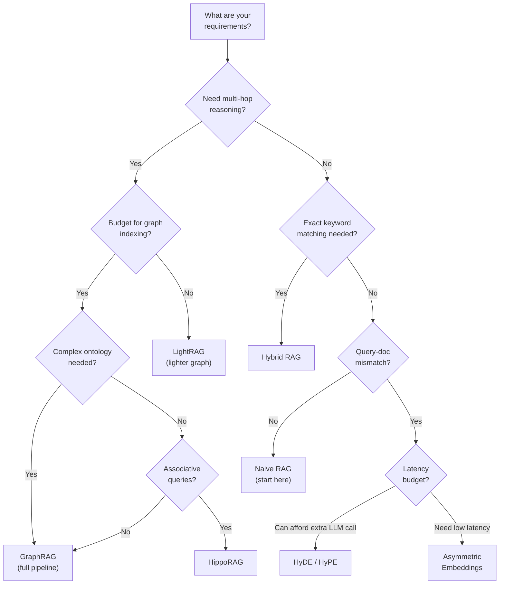

import CrossReference from '../../../components/CrossReference.astro';
import DiagramBlock from '../../../components/DiagramBlock.astro';
import ComparisonTable from '../../../components/ComparisonTable.astro';
import PathNotTaken from '../../../components/PathNotTaken.astro';

# Decision Guide

## Choosing Your RAG Architecture

There is no single "best" RAG approach. The right choice depends on your corpus, query patterns, latency requirements, and budget. This guide helps you navigate the trade-offs.

## The Decision Tree

<DiagramBlock caption="Decision tree for choosing a RAG approach" label="RAG decision tree">

</DiagramBlock>

## Requirement-Based Comparison

### By Query Complexity

<ComparisonTable
  columns={["Query Type", "Example", "Best Approach", "Why"]}
  filterColumn="Query Type"
  rows={[
    ["Simple factual", "What is the capital of France?", "Naive RAG", "Direct semantic match works fine"],
    ["Keyword-specific", "What does RFC 7519 specify?", "Hybrid RAG", "Needs exact term matching"],
    ["Question-style", "How does photosynthesis work?", "HyDE + Naive RAG", "Bridges question-answer gap"],
    ["Multi-hop", "How does Company X's CEO relate to Project Y?", "GraphRAG", "Requires entity traversal"],
    ["Thematic", "What are the main themes in this corpus?", "GraphRAG (global)", "Community summaries capture themes"],
    ["Associative", "What concepts relate to memory consolidation?", "HippoRAG", "Memory-based association"],
    ["Cross-document", "Compare approaches X and Y across papers", "LightRAG", "Cross-document entity dedup"],
  ]}
/>

### By Corpus Characteristics

<ComparisonTable
  columns={["Corpus Type", "Size", "Recommended Stack", "Rationale"]}
  filterColumn="Corpus Type"
  rows={[
    ["FAQ / Support docs", "Small (<1K docs)", "Naive RAG or HyDE", "Simple structure, direct answers"],
    ["Technical documentation", "Medium", "Hybrid RAG", "Exact terms + semantic understanding"],
    ["Research papers", "Medium-Large", "GraphRAG or LightRAG", "Dense relationships between concepts"],
    ["Legal documents", "Large", "Hybrid RAG + GraphRAG", "Exact citations + structural relationships"],
    ["Knowledge base / Wiki", "Large", "LightRAG or HippoRAG", "Cross-document entities, associative links"],
    ["Mixed / Heterogeneous", "Any", "Hybrid RAG + LightRAG", "Handles varied content types"],
  ]}
/>

## The Practical Starting Path

<PathNotTaken title="Starting with the most complex approach" reason="Building GraphRAG from day one is premature optimization. You spend weeks on infrastructure before validating that your retrieval even needs graph-based reasoning. Most use cases are well-served by simpler approaches." />

### Step 1: Start with Naive RAG

Always start here. It gives you:
- A working baseline to measure against
- Understanding of where your specific corpus fails
- Data to justify the complexity of advanced approaches

### Step 2: Identify Your Failure Mode

Run queries and categorize failures:

| Failure Pattern | What You See | Next Step |
|----------------|-------------|-----------|
| Wrong chunks retrieved | Relevant docs exist but aren't returned | Try HyDE or Hybrid RAG |
| Missing keyword matches | Exact terms not found | Add sparse retrieval (Hybrid RAG) |
| Missing connections | Answer requires info from multiple chunks | Consider graph-based approaches |
| Wrong context | Retrieved chunks lack surrounding context | Consider LightRAG or larger chunks |

### Step 3: Add One Layer at a Time

Each layer from the <CrossReference slug="04-synthesis/progressive-map" /> can be added incrementally:

1. **HyDE** — Lowest effort, biggest immediate improvement for question-answering
2. **Hybrid retrieval** — Add BM25 alongside vectors for keyword coverage
3. **LightRAG** — If cross-document relationships matter
4. **GraphRAG** — If you need community-level summaries or complex traversals
5. **HippoRAG + PPR** — For the most sophisticated retrieval needs

## Combinations That Work Well

Not all techniques need to be used in isolation. Here are proven combinations:

<ComparisonTable
  columns={["Combination", "Use Case", "Complexity"]}
  rows={[
    ["HyDE + Hybrid RAG", "General-purpose improvement over Naive RAG", "Low-Medium"],
    ["Hybrid RAG + LightRAG", "Technical documentation with cross-references", "Medium"],
    ["GraphRAG + PPR", "Research corpus requiring multi-hop reasoning", "High"],
    ["HippoRAG + Hybrid RAG", "Knowledge bases with associative queries", "High"],
  ]}
/>

## Anti-Patterns to Avoid

1. **Over-indexing** — Building a full knowledge graph for a simple FAQ system wastes resources without improving quality.

2. **Ignoring evaluation** — Without measuring retrieval quality (precision, recall, MRR), you cannot know if your "improvement" actually helped.

3. **Skipping the baseline** — Jumping to GraphRAG without trying Naive RAG first means you don't know which problems you're actually solving.

4. **Single-metric optimization** — Optimizing only for recall (retrieving everything relevant) without considering precision (avoiding irrelevant results) leads to noisy context that degrades generation quality.

## Summary

The RAG landscape is not a competition where one approach "wins." It's a toolkit where each technique addresses specific failure modes. Your job is to:

1. Understand your corpus and query patterns
2. Identify specific failure modes
3. Apply the minimum complexity needed to address those failures
4. Measure and iterate

Start simple. Add complexity only when measurement shows it's needed. The <CrossReference slug="01-foundation/problem-tree" /> is your map; this guide is your compass.
