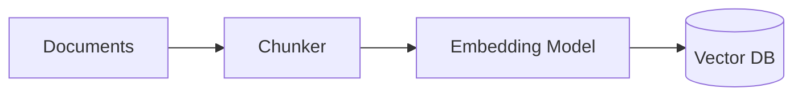
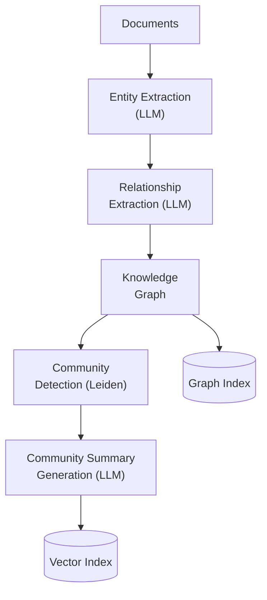
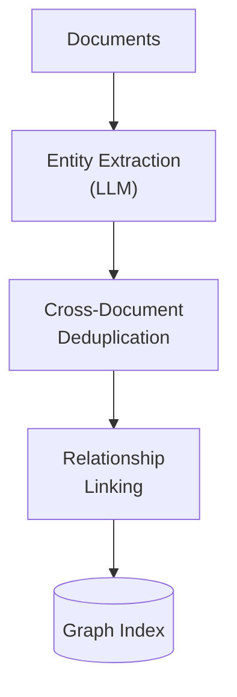
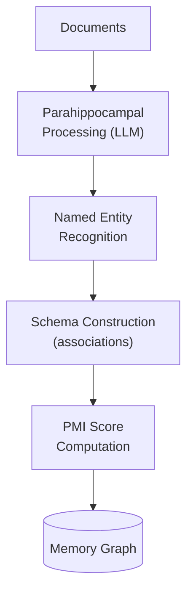

import CrossReference from '../../../components/CrossReference.astro';
import DiagramBlock from '../../../components/DiagramBlock.astro';
import ComparisonTable from '../../../components/ComparisonTable.astro';
import SummaryBox from '../../../components/SummaryBox.astro';

# Indexing Comparison

<SummaryBox>

**This page compares what each RAG approach indexes, the cost of indexing, and what retrieval capabilities that unlocks.**

**Key insight:** More expensive indexing (entity extraction, graph construction) buys more powerful retrieval (multi-hop, associative).

**What to compare:**
- **Index structure:** Vectors only vs. vectors + graph vs. graph only
- **Indexing cost:** LLM calls, compute time, storage
- **Retrieval capabilities:** What queries each approach can answer
- **Maintenance:** How hard is it to update the index?

**Use this page to:** Understand the indexing cost vs. retrieval power trade-off for each technique.

</SummaryBox>

## What Gets Indexed Matters

The way a RAG system indexes documents determines what it can retrieve. Each approach makes different trade-offs between indexing cost, retrieval capability, and maintenance complexity.

## Side-by-Side: Index Structures

<ComparisonTable
  columns={["Approach", "What Gets Indexed", "Index Type", "Indexing Cost"]}
  filterColumn="Approach"
  rows={[
    ["Naive RAG", "Text chunks → vectors", "Vector DB", "Low"],
    ["HyDE / HyPE", "Same as Naive RAG (transform happens at query time)", "Vector DB", "Low"],
    ["Hybrid RAG", "Text chunks → vectors + inverted index", "Vector DB + BM25 index", "Medium"],
    ["GraphRAG", "Entities, relationships, community summaries → vectors + graph", "Vector DB + Graph DB", "High"],
    ["LightRAG", "Deduplicated entities + relationships → graph", "Graph index", "Medium"],
    ["HippoRAG", "Entities as memory nodes + associations", "Graph index + PMI scores", "Medium-High"],
  ]}
/>

## Indexing Pipelines Compared

### Naive RAG Indexing

<DiagramBlock caption="Naive RAG: documents → chunks → vectors" label="Naive RAG indexing">

</DiagramBlock>

**Input**: Raw documents
**Output**: Vector embeddings of fixed-size chunks
**Cost**: One embedding call per chunk
**Limitation**: No structure preserved

### GraphRAG Indexing

<DiagramBlock caption="GraphRAG: multi-stage extraction pipeline" label="GraphRAG indexing">

</DiagramBlock>

**Input**: Raw documents
**Output**: Knowledge graph + community summaries + vector embeddings
**Cost**: Multiple LLM calls per document (entity extraction, relationship extraction, summarization)
**Advantage**: Rich structural understanding

### LightRAG Indexing

<DiagramBlock caption="LightRAG: lightweight graph with deduplication" label="LightRAG indexing">

</DiagramBlock>

**Input**: Raw documents
**Output**: Deduplicated entity graph
**Cost**: Fewer LLM calls than GraphRAG (no community summarization)
**Advantage**: Simpler graph, cross-document entity resolution

### HippoRAG Indexing

<DiagramBlock caption="HippoRAG: memory-inspired indexing" label="HippoRAG indexing">

</DiagramBlock>

**Input**: Raw documents
**Output**: Memory graph with association strengths (PMI scores)
**Cost**: LLM calls for processing + statistical computation for PMI
**Advantage**: Mimics human memory, handles ambiguity well

## Retrieval Comparison

What happens when a query arrives?

<ComparisonTable
  columns={["Approach", "Query Processing", "Retrieval Method", "What's Returned"]}
  filterColumn="Approach"
  rows={[
    ["Naive RAG", "Embed query directly", "k-NN vector search", "Top-k text chunks"],
    ["HyDE", "LLM generates hypothetical answer, embed that", "k-NN vector search", "Top-k text chunks"],
    ["HyPE", "LLM generates N hypothetical passages", "k-NN for each passage, merge", "Merged top-k chunks"],
    ["Hybrid RAG", "Embed query + tokenize for BM25", "Dense + sparse search, fuse scores", "Re-ranked chunks"],
    ["GraphRAG", "Extract entities from query, match to graph", "Graph traversal + community lookup", "Entities + relationships + summaries"],
    ["LightRAG", "Extract entities from query", "Graph traversal, fetch connected nodes", "Deduplicated entities + relationships"],
    ["HippoRAG", "Extract query entities (pattern separation)", "PPR from query nodes (pattern completion)", "Subgraph of relevant memories"],
  ]}
/>

## Cost Comparison

<ComparisonTable
  columns={["Approach", "Index Build Time", "Per-Query Cost", "Storage", "Update Cost"]}
  filterColumn="Approach"
  rows={[
    ["Naive RAG", "Minutes", "1 embedding call", "Vector DB only", "Re-embed changed chunks"],
    ["HyDE", "Minutes", "1 LLM + 1 embedding", "Vector DB only", "Re-embed changed chunks"],
    ["Hybrid RAG", "Minutes", "1 embedding + 1 BM25 query", "Vector DB + inverted index", "Re-embed + re-index"],
    ["GraphRAG", "Hours (LLM-heavy)", "Graph lookup + optional LLM", "Vector DB + Graph DB", "Re-extract affected subgraph"],
    ["LightRAG", "30-60 min", "Graph lookup", "Graph index", "Incremental entity update"],
    ["HippoRAG", "30-60 min", "NER + PPR computation", "Graph + PMI matrix", "Re-compute associations"],
  ]}
/>

## When Each Indexing Approach Shines

- **Naive RAG / HyDE**: Small-to-medium corpora, factual Q&A, fast iteration needed
- **Hybrid RAG**: When exact term matching matters (technical docs, legal, medical)
- **GraphRAG**: Complex multi-hop questions over large corpora, thematic summarization
- **LightRAG**: Cross-document entity resolution, medium complexity needs
- **HippoRAG**: Associative queries, when context spans many documents

## What's Next

Use the <CrossReference slug="04-synthesis/decision-guide" /> to choose the right approach (or combination) for your specific use case.
