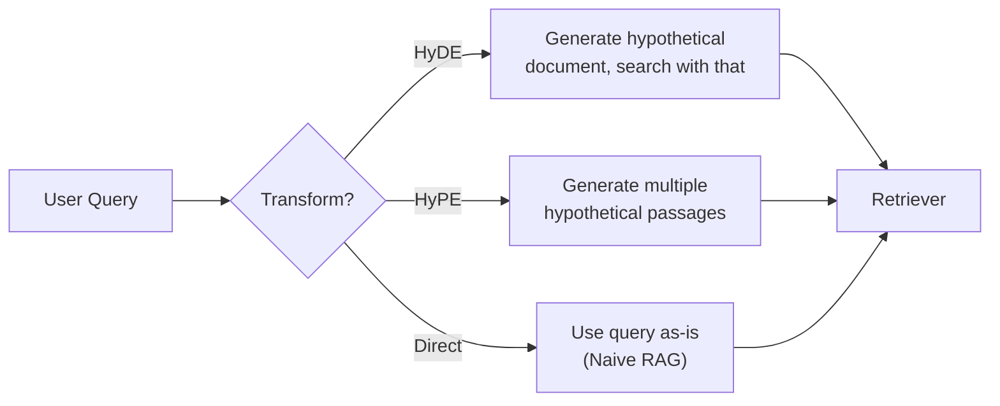
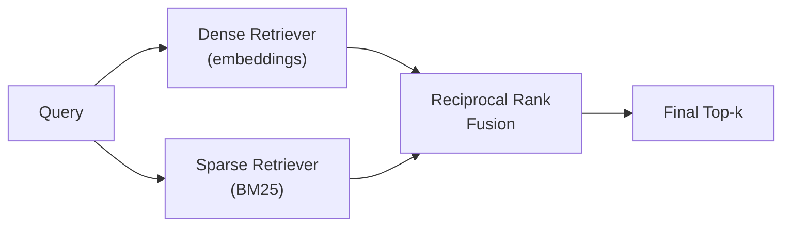
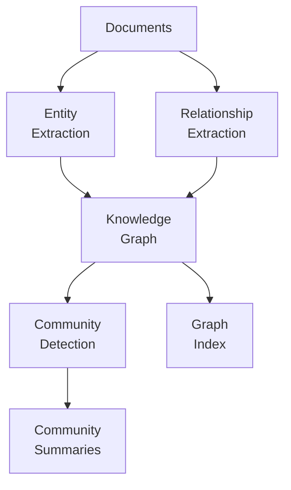
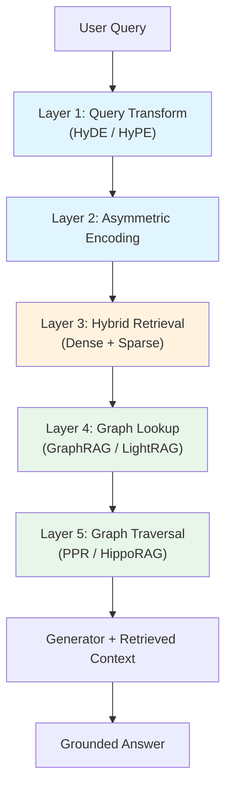

import CrossReference from '../../../components/CrossReference.astro';
import DiagramBlock from '../../../components/DiagramBlock.astro';
import ComparisonTable from '../../../components/ComparisonTable.astro';

# The Progressive Map

## From Simple to Complex

Every technique we've explored builds on something simpler. This page maps the entire progression — from a single embedding to full graph-based retrieval with Personalized PageRank.

## Layer 0: The Baseline

<CrossReference slug="01-foundation/naive-rag" /> gives us the starting point: chunk documents, embed them, retrieve by vector similarity, generate an answer.

**What it gets right**: Semantic similarity works for straightforward factual queries with well-written source text.

**Where it breaks**: Query-document mismatch, no structure, no exact matching, lost context.

## Layer 1: Fixing the Query

The first layer of improvements transforms the query before retrieval.

<DiagramBlock caption="Layer 1: Query transformation techniques" label="Query transformation layer">

</DiagramBlock>

| Technique | Adds to Baseline | Cost |
|-----------|-----------------|------|
| <CrossReference slug="02-retrieval-strategies/hyde" /> | 1 extra LLM call per query | Higher latency, potential hallucination in hypothesis |
| <CrossReference slug="02-retrieval-strategies/hype" /> | N extra LLM calls per query | Higher latency, more diverse coverage |

## Layer 2: Fixing the Embedding Space

Rather than transforming queries, this layer fixes the embedding space itself.

<CrossReference slug="02-retrieval-strategies/asymmetric-embeddings" /> uses separate encoders for queries and documents, accepting that they occupy different linguistic spaces. This is a training-time solution (vs. HyDE/HyPE which are inference-time solutions).

## Layer 3: Fixing the Retriever

<CrossReference slug="02-retrieval-strategies/hybrid-rag" /> combines dense (semantic) and sparse (keyword) retrieval. This is orthogonal to Layers 1-2 — you can apply hybrid retrieval with or without query transformation.

<DiagramBlock caption="Layer 3: Hybrid retrieval" label="Hybrid retrieval diagram">

</DiagramBlock>

## Layer 4: Adding Structure

This is the biggest jump in complexity. Instead of treating documents as flat text, we extract structured knowledge.

<DiagramBlock caption="Layer 4: From flat text to knowledge graphs" label="Knowledge graph layer">

</DiagramBlock>

| Technique | What It Adds | Complexity |
|-----------|-------------|------------|
| <CrossReference slug="03-graph-rag/graphrag" /> | Full entity/relationship extraction, community detection | High — LLM calls for extraction |
| <CrossReference slug="03-graph-rag/ontology" /> | Formal categorization (endurants vs. perdurants) | Conceptual — guides graph design |
| <CrossReference slug="03-graph-rag/lightrag" /> | Lightweight graph + cross-document dedup | Medium — simpler extraction |

## Layer 5: Intelligent Graph Traversal

Having a knowledge graph is not enough — you need to traverse it intelligently at query time.

| Technique | Traversal Strategy |
|-----------|-------------------|
| <CrossReference slug="03-graph-rag/hipporag" /> | Memory-inspired pattern separation and completion |
| <CrossReference slug="03-graph-rag/ppr" /> | Personalized PageRank to find relevant subgraphs |

## The Complete Stack

<DiagramBlock caption="All layers composed into a complete RAG system" label="Complete RAG stack">

</DiagramBlock>

**You don't need every layer.** Most real-world systems use a subset. The <CrossReference slug="04-synthesis/decision-guide" /> helps you pick which layers to adopt based on your requirements.

## Complexity vs. Capability Trade-off

<ComparisonTable
  columns={["Layer", "Techniques", "Capability Gained", "Complexity Added"]}
  rows={[
    ["0 - Baseline", "Naive RAG", "Semantic retrieval", "Minimal"],
    ["1 - Query Fix", "HyDE, HyPE", "Better recall for questions", "Low (extra LLM calls)"],
    ["2 - Embedding Fix", "Asymmetric models", "Native query-doc handling", "Low (model swap)"],
    ["3 - Retriever Fix", "Hybrid RAG", "Exact + semantic matching", "Medium (two retrievers)"],
    ["4 - Structure", "GraphRAG, LightRAG", "Entity/relationship awareness", "High (graph pipeline)"],
    ["5 - Traversal", "PPR, HippoRAG", "Multi-hop reasoning", "High (graph algorithms)"],
  ]}
/>

## What's Next

See how different approaches handle indexing in <CrossReference slug="04-synthesis/indexing-comparison" />, then use the <CrossReference slug="04-synthesis/decision-guide" /> to choose the right combination for your use case.
