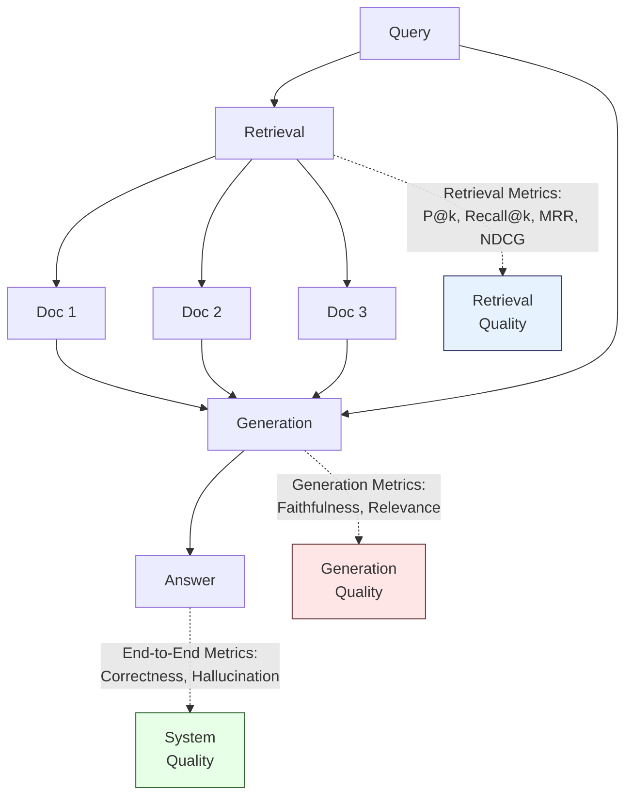
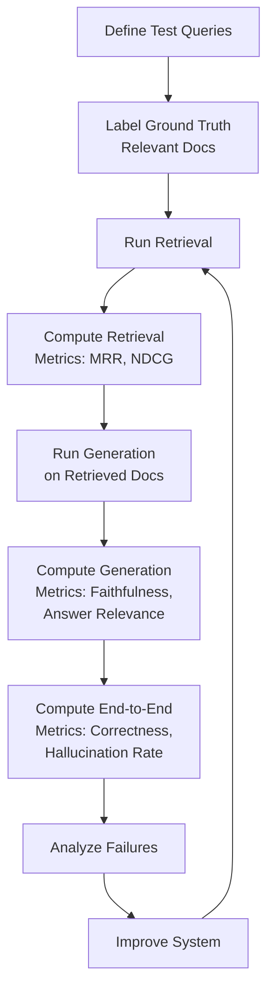

import CrossReference from '../../../components/CrossReference.astro';
import DiagramBlock from '../../../components/DiagramBlock.astro';
import ComparisonTable from '../../../components/ComparisonTable.astro';
import SummaryBox from '../../../components/SummaryBox.astro';
import PathNotTaken from '../../../components/PathNotTaken.astro';

<SummaryBox>

**You cannot improve what you cannot measure. RAG evaluation requires metrics for three layers: retrieval quality, generation quality, and end-to-end correctness.**

**Retrieval metrics:** Precision@k, Recall@k, MRR (Mean Reciprocal Rank), NDCG (Normalized Discounted Cumulative Gain)

**Generation metrics:** Faithfulness (grounded in retrieved context), answer relevance, context relevance

**End-to-end metrics:** Answer correctness, hallucination rate

**The evaluation paradox:** You need ground truth to evaluate, but creating ground truth is expensive and subjective.

</SummaryBox>

## Why Evaluation Is Hard

The <CrossReference slug="05-synthesis/decision-guide" /> mentions measuring retrieval quality with "precision, recall, MRR" — but nowhere have we defined what these metrics actually measure or how to compute them. This page fills that gap.

RAG evaluation is harder than traditional ML evaluation because:

1. **Multiple failure modes**: Retrieval can fail (wrong documents), generation can fail (hallucination), or both can succeed individually but produce wrong answers
2. **Subjectivity**: What counts as "correct" often requires human judgment
3. **Context dependence**: The same answer might be right for one query but wrong for a slightly different one
4. **No single metric**: Unlike classification accuracy, RAG requires multiple metrics to capture different dimensions of quality

## The Three Evaluation Layers

<DiagramBlock caption="RAG evaluation requires measuring three distinct layers" label="RAG evaluation layers">

</DiagramBlock>

You can have perfect retrieval but poor generation, or vice versa. Measuring all three layers helps diagnose where your system fails.

## Layer 1: Retrieval Metrics

Retrieval metrics measure: **Did we retrieve the right documents?** This requires ground truth — a labeled dataset where each query is paired with the set of documents that should have been retrieved.

### Precision@k and Recall@k

The most fundamental retrieval metrics.

**Precision@k** measures what fraction of the top-k retrieved documents are relevant:

$$\text{Precision@}k = \frac{\text{\# relevant docs in top-}k}{k}$$

**Example:** For query "What causes climate change?", your system retrieves 10 documents. Of those, 7 are actually relevant.
- Precision@10 = 7/10 = 0.7 (70% of retrieved docs are relevant)

**Recall@k** measures what fraction of all relevant documents were retrieved in the top-k:

$$\text{Recall@}k = \frac{\text{\# relevant docs in top-}k}{\text{total \# relevant docs}}$$

**Example:** There are 15 documents in your corpus that answer the climate change query. Your system retrieves 7 of them in the top-10.
- Recall@10 = 7/15 = 0.47 (retrieved 47% of relevant docs)

**The trade-off:** High k increases recall but decreases precision. Low k increases precision but decreases recall. You need both metrics.

### Mean Reciprocal Rank (MRR)

MRR measures: **How soon does the first relevant document appear?**

$$\text{MRR} = \text{average}\left(\frac{1}{\text{rank of first relevant document}}\right)$$

**Example:**
- Query 1: First relevant doc at rank 1 → reciprocal rank = 1/1 = 1.0
- Query 2: First relevant doc at rank 3 → reciprocal rank = 1/3 = 0.33
- Query 3: First relevant doc at rank 2 → reciprocal rank = 1/2 = 0.5
- MRR = (1.0 + 0.33 + 0.5) / 3 = 0.61

**Why it matters:** For RAG, the position of the first relevant document is often more important than the total number of relevant documents in top-k. If the first relevant doc is at rank 15, the LLM may never see it (context window limits).

### Normalized Discounted Cumulative Gain (NDCG)

NDCG accounts for both **relevance** and **position**. Unlike binary relevant/not-relevant, it allows graded relevance scores.

$$\text{DCG@}k = \sum_{i=1}^{k} \frac{\text{relevance\_score}_i}{\log_2(i + 1)}$$

$$\text{NDCG@}k = \frac{\text{DCG@}k}{\text{IDCG@}k} \quad \text{(normalized by ideal DCG)}$$

**Example:** Top-3 retrieved docs have relevance scores [3, 2, 0] (on a scale of 0-3):
- DCG@3 = 3/log2(2) + 2/log2(3) + 0/log2(4) = 3.0 + 1.26 + 0 = 4.26
- If ideal ranking were [3, 2, 1], IDCG@3 = 4.26 + 0.63 = 4.89
- NDCG@3 = 4.26 / 4.89 = 0.87

**Why it matters:** NDCG is the most sophisticated retrieval metric. It rewards systems that rank highly relevant documents above marginally relevant ones, and it penalizes relevant documents that appear late in the ranking.

### Which Retrieval Metric to Use?

| Metric | Strengths | Use When |
|--------|-----------|----------|
| **Precision@k** | Simple, interpretable | You care about relevance of what was retrieved |
| **Recall@k** | Measures coverage | You need to find all relevant documents |
| **MRR** | Focuses on first relevant hit | Users only read top results (most RAG cases) |
| **NDCG** | Accounts for graded relevance + position | You have graded relevance judgments, not binary |

**Recommendation for RAG:** Report MRR and NDCG@10. MRR tells you if users get a relevant document immediately. NDCG@10 tells you if the top-10 ranking is high-quality.

## Layer 2: Generation Metrics

Generation metrics measure: **Did the LLM use the retrieved documents correctly?** These can be computed without ground-truth answers by checking the relationship between the query, retrieved documents, and generated answer.

### Faithfulness (Answer Grounding)

**Definition:** What fraction of statements in the generated answer are supported by the retrieved context?

This is measured by breaking the answer into claims and checking if each claim can be verified against the retrieved documents. Typically requires an LLM-as-judge.

**Example:**
- Retrieved context: "Greenhouse gases trap heat. CO2 is a greenhouse gas."
- Generated answer: "CO2 traps heat by absorbing infrared radiation, which causes global warming."
- Faithfulness = 0.5 (first part supported, "infrared radiation" not mentioned in context)

**Why it matters:** Low faithfulness = hallucination. The LLM is inventing facts not present in the retrieved documents.

### Answer Relevance

**Definition:** How well does the generated answer address the user's query?

Even if an answer is faithful to the retrieved context, it might not answer the question. Answer relevance checks if the answer is on-topic.

**Example:**
- Query: "What causes climate change?"
- Answer: "The greenhouse effect was first described in 1824."
- Answer relevance = Low (factual but doesn't answer the question)

### Context Relevance

**Definition:** How many of the retrieved documents were actually used in the generated answer?

If the retrieval pulled 10 documents but the LLM only used 2, the other 8 wasted context window space. Low context relevance indicates retrieval is pulling irrelevant documents.

## Layer 3: End-to-End Metrics

End-to-end metrics measure: **Is the final answer correct?** This requires ground truth answers or human evaluation.

### Answer Correctness

**Definition:** Does the generated answer match the ground truth answer?

This can be measured with:
- **Exact match**: String equality (too strict for most cases)
- **Semantic similarity**: Embed both answers and compute cosine similarity
- **LLM-as-judge**: Use a strong LLM to evaluate if the generated answer is equivalent to the ground truth

### Hallucination Rate

**Definition:** What fraction of generated answers contain statements that contradict the retrieved context or introduce unsupported facts?

Hallucination detection typically requires:
1. Extract claims from the generated answer
2. For each claim, check if it's supported by retrieved context or contradicts it
3. Compute: (# hallucinated claims) / (total # claims)

## Evaluation Frameworks

Rather than implementing these metrics from scratch, use existing frameworks:

### RAGAS (RAG Assessment)

Open-source framework that computes:
- Faithfulness
- Answer relevance
- Context relevance
- Context precision (how high relevant docs are ranked)
- Context recall (what fraction of ground truth answer can be attributed to retrieved context)

**Pros:** No ground truth answers required for most metrics
**Cons:** Requires LLM-as-judge (adds cost and latency)

### LlamaIndex Evaluation

Built into LlamaIndex, provides:
- Retrieval evaluation (hit rate, MRR)
- Response evaluation (faithfulness, relevance)
- Pairwise comparison between RAG systems

### DeepEval

Specialized for LLM system evaluation, includes:
- Answer relevance
- Faithfulness
- Contextual precision
- Hallucination detection
- Custom metrics via LLM grading

## The Evaluation Paradox

To evaluate retrieval, you need to know which documents are relevant for each query. To evaluate answer correctness, you need ground truth answers. But creating this labeled data is expensive and subjective:

1. **Manual labeling is slow**: Humans must read documents and judge relevance
2. **Subjectivity**: Different judges may disagree on what's "relevant"
3. **Domain expertise required**: Technical domains require expert judges
4. **Dataset bias**: Evaluation set may not represent real user queries

<PathNotTaken title="Using synthetic eval data generated by LLMs" reason="LLM-generated questions and answers can create evaluation datasets cheaply, but they suffer from distribution shift — real users ask questions differently than LLMs generate them. Synthetic eval is useful for sanity checks but cannot replace real user data." />

### Practical Approaches

1. **Start with a small human-labeled eval set** (50-100 queries)
2. **Use LLM-as-judge for generation metrics** (faithfulness, relevance)
3. **Track metrics over time** — relative changes matter more than absolute values
4. **Combine automatic metrics with spot-checking** — manually review 10-20 failures per week
5. **A/B test in production** — let real users tell you what works

## Putting It All Together

A complete RAG evaluation workflow:

**Key insight:** The three layers are independent. You can improve retrieval without touching generation, or vice versa. Measure all three to diagnose where your system fails.

## Benchmarks

Public RAG benchmarks for comparing approaches:

| Benchmark | Domain | Queries | Documents | Metric Focus |
|-----------|--------|---------|-----------|--------------|
| **MS MARCO** | Web search | 1M+ | 8.8M passages | Retrieval (MRR@10) |
| **Natural Questions** | Wikipedia | 300K | Wikipedia | End-to-end correctness |
| **HotpotQA** | Multi-hop QA | 113K | Wikipedia | Multi-hop reasoning |
| **BEIR** | Multiple domains | Varies | Varies | Cross-domain retrieval |

## What's Next

With evaluation metrics in hand, you can now systematically compare RAG approaches using the <CrossReference slug="05-synthesis/decision-guide" /> and measure improvement as you iterate.

**Remember:** Evaluation is not a one-time activity. As your corpus evolves and users ask new kinds of questions, your evaluation set must evolve too. Set up continuous evaluation that runs on every system change.
